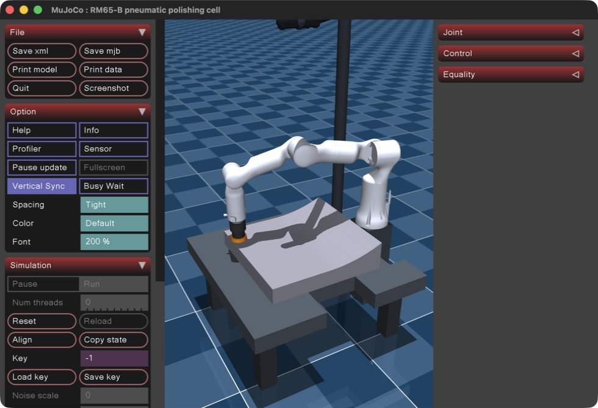
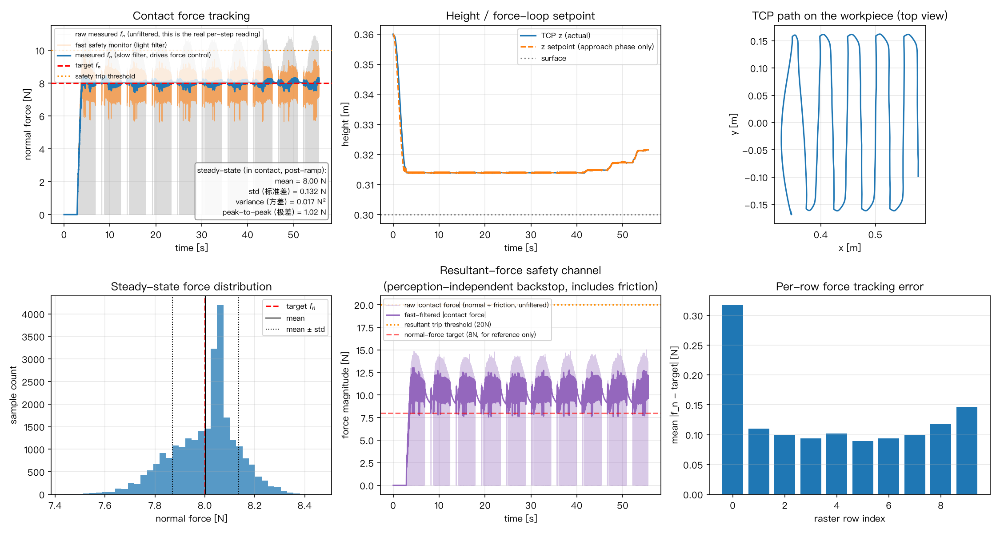

# Robotic Polishing Force Control

基于 MuJoCo 的机器人恒力打磨仿真：睿尔曼 RM65-B 六轴机械臂搭载气动柔顺打磨头，由固定式 Orbbec Gemini 336L 深度相机估计工件局部表面法线，在平面—圆弧连续工件上执行全覆盖光栅扫描和法向力控制。

这个仓库不仅包含一段控制脚本，还包含完整的机器人、工具、相机与工件模型，控制与感知实现，仿真结果，以及从基础概念到参数调试的配套教材。



## 项目包含什么

- **机器人本体**：RM65-B 六轴机械臂的运动学、惯量、关节限制、执行器与官方外观网格。
- **柔顺末端**：带轴向滑动、弹簧阻尼、气动预载和柔性背衬等效模型的打磨头。
- **工件与轨迹**：左半平面、右半真圆弧的连续曲面，以及覆盖整个工件的 13 行往复式光栅轨迹。
- **感知模块**：从仿真深度相机生成点云，分箱拟合局部法线，并构造随曲面变化的表面坐标系。
- **混合控制器**：切平面内使用任务空间阻抗控制跟踪轨迹，法线方向使用显式 PI 力控制维持目标接触力。
- **安全机制**：命令限幅、独立快速力监控、持续过力判定、主动撤离和故障锁定。
- **结果与教材**：参考仿真曲线，以及一份解释控制理论、代码实现与参数调试的完整 Markdown 教材。

## 系统主线


控制器把任务分解到局部表面坐标系：沿法线 \(\mathbf{n}\) 调节接触力 \(f_n\)，在与 \(\mathbf{n}\) 正交的切平面内跟踪光栅轨迹。这样经过圆弧区域时，位置控制与力控制仍保持正交，不会在同一方向互相对抗。

## 仓库结构

```text
robotic-polishing-force-control/
├── README.md
├── artifacts/
│   ├── rm65_full_coverage_orbbec_final.jpeg
│   └── rm65_short_pneumatic_head_65mm.jpeg
├── notes/
│   ├── mujoco_polishing_textbook.md       # 完整中文教材
│   └── img/                               # 教材引用的控制图与分析图
└── scripts/mujoco/mujoco_polishing_sim/
    ├── polish_impedance_control.py        # 仿真与控制主入口
    ├── polish_scene.xml                   # 工作站、相机与工件场景
    ├── rm65b_pneumatic.xml                # RM65-B 与气动打磨头模型
    ├── panda_torque.xml                   # 早期 Franka Panda 对照模型
    ├── README_polish.md                   # 子项目运行说明
    ├── polish_result.png                  # 当前仿真输出
    ├── polish_result_reference.png        # 参考输出
    └── assets/
        ├── rm65/                          # RM65-B 网格与许可证
        └── orbbec/                        # Gemini 336L 网格与来源说明
```

### 核心文件职责

| 文件 | 作用 |
| --- | --- |
| `polish_impedance_control.py` | 生成曲面、模拟点云、估计法线、生成光栅轨迹、执行混合力/位控制、安全监控并绘制结果。 |
| `polish_scene.xml` | 组合机器人模型，定义工作台、平面—圆弧工件、固定相机、灯光和观察视角。 |
| `rm65b_pneumatic.xml` | 定义 RM65-B 刚体链、关节、执行器，以及气动柔顺打磨头。 |
| `mujoco_polishing_textbook.md` | 从 Python/NumPy、阻抗控制和雅可比矩阵开始，解释完整实现与调参依据。 |
| `README_polish.md` | 记录 MuJoCo 子项目的依赖、无头运行、macOS GUI 和相机视角用法。 |

## 快速开始

### 1. 获取代码并创建环境

```bash
git clone git@github.com:CSQ-AN94/robotic-polishing-force-control.git
cd robotic-polishing-force-control/scripts/mujoco/mujoco_polishing_sim

python3 -m venv .venv
source .venv/bin/activate
python -m pip install --upgrade pip
python -m pip install mujoco numpy matplotlib
```

### 2. 无头运行

```bash
python polish_impedance_control.py
```

仿真结束后会在当前目录生成或更新 `polish_result.png`，其中包含轨迹、法向力、滤波信号、安全阈值和逐行误差等结果。

### 3. GUI 运行

```bash
mjpython polish_impedance_control.py --view
```

可用 `--camera` 选择预定义视角：

```bash
mjpython polish_impedance_control.py --view --camera=cell_view
mjpython polish_impedance_control.py --view --camera=tool_view
mjpython polish_impedance_control.py --view --camera=camera_view
```

macOS 的 `mjpython` 环境和带空格路径注意事项见 [`README_polish.md`](scripts/mujoco/mujoco_polishing_sim/README_polish.md)。GUI 会循环播放仿真，关闭窗口后停止。

## 控制流程

1. **接近阶段**：末端在位置与姿态方向均使用任务空间阻抗控制，平滑下降到工件表面。
2. **接触过渡**：目标法向力通过 smoothstep 从 \(0\,\mathrm{N}\) 平滑增加到 \(8\,\mathrm{N}\)，降低首次接触冲击。
3. **打磨阶段**：
   - 点云模块估计当前位置的局部法线；
   - 切向阻抗控制跟踪全覆盖光栅轨迹；
   - 法向 PI 力控制调节接触力；
   - 重力、科氏力和离心力通过 MuJoCo 的 `qfrc_bias` 前馈补偿。
4. **安全阶段**：快速滤波通道独立监测法向力与合力；持续过力时立即撤离，释放接触后进入锁定状态，本轮不自动恢复打磨。

主要可调参数集中在 `polish_impedance_control.py` 顶部，包括：

- 切向刚度与阻尼：`KP_POS_XY`、`KD_POS_XY`
- 法向力环：`F_TARGET`、`KP_F`、`KI_F`、`BZ`
- 安全阈值：`F_RETREAT_TRIGGER`、`F_RESULTANT_TRIGGER`
- 光栅覆盖：`RASTER_X_MIN/MAX`、`RASTER_Y_MIN/MAX`、`RASTER_ROWS`

## 输出示例



上图由当前控制脚本实际运行生成，展示接触力跟踪、末端高度、工件表面轨迹、稳态力分布、合力安全通道和逐行跟踪误差。

## 模型来源与限制

- RM65-B 网格来自睿尔曼官方 `RealManRobot/rm_robot`，授权信息见 [`assets/rm65/LICENSE`](scripts/mujoco/mujoco_polishing_sim/assets/rm65/LICENSE)。
- Gemini 336L 资源的来源与许可说明见 [`assets/orbbec/SOURCE.md`](scripts/mujoco/mujoco_polishing_sim/assets/orbbec/SOURCE.md) 和 [`assets/orbbec/LICENSE`](scripts/mujoco/mujoco_polishing_sim/assets/orbbec/LICENSE)。
- `panda_torque.xml` 是早期 Franka Panda 原型，仅用于对照；其外部网格未包含在仓库中，因此不能直接加载为完整可视化模型。
- 当前 Gemini 336L 是仿真相机。迁移到真实系统时，需要替换为设备内参、eye-to-hand 标定外参和真实传感器数据管线。
