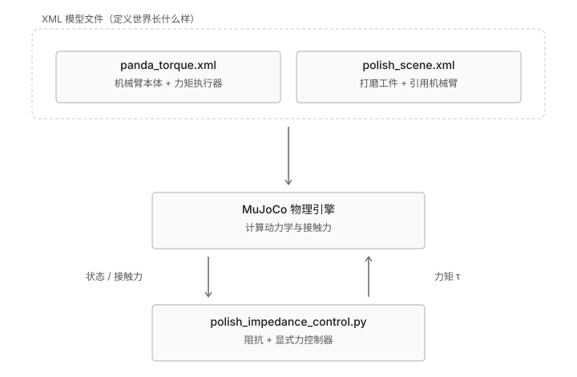

# MuJoCo 打磨仿真学习任务清单（v2：光栅扫描 + 真圆弧曲面）

对应代码：

```text
scripts/mujoco/mujoco_polishing_sim/polish_impedance_control.py
scripts/mujoco/mujoco_polishing_sim/panda_torque.xml
scripts/mujoco/mujoco_polishing_sim/polish_scene.xml
```

> 这份清单是旧版（画一个固定小圆）的更新版。核心控制算法（阻抗控制 + 显式力控的混合结构）完全没变，变的是：工件表面从"纯平面"改成了"一半平、一半真圆弧"，轨迹从"画一个 6cm 小圆"改成了"来回扫描覆盖整个工件表面"，另外 xy 方向的刚度和 GUI 默认视角也跟着调整了。如果你还没搞懂旧版的阶段 0-5，先去看看 git 历史或者问我要旧版内容——这份清单默认你已经理解了阻抗控制 vs 显式力控那套基本逻辑，直接在此基础上往上加。

这是 [force_control_learning_guide.md](force_control_learning_guide.md) 那条主线（robosuite `OSC_POSE`）的进阶版，具体关系见该文件。

## 大地图一：三层架构

谁定义世界、谁算物理、谁做决策（这张图没变，仍然成立）：



现在 `polish_scene.xml` 这一层里多了两个东西：一个高度场（`hfield`，定义工件的平面+圆弧曲面）和一个固定相机（`pad_view`，自动对准打磨头）。

## 大地图二：控制循环每一帧在干什么

这张图也没变——阻抗控制/显式力控的分支逻辑是同一套，只是阶段 2 里"任务空间力"的 xy 分量现在来自一个光栅扫描函数，不再是画圆的公式：


---

## 阶段 0：跑通环境（复习）

```bash
# 无头模式
"/Users/siqi.cai/Robot Manipulation/Force Control/.venv/bin/python" polish_impedance_control.py

# GUI 模式（会一直循环播放，直到你关窗口；默认机位是自动对准打磨头的固定相机）
cd "scripts/mujoco/mujoco_polishing_sim"
".viewer_venv/bin/python3.13" ".viewer_venv/bin/mjpython" polish_impedance_control.py --view
```

在 GUI 窗口里按 `Tab` 能切回自由视角，自己拖鼠标看别的角度。

### 通过标准
知道现在跑一轮要多久（提示：改完之后单轮时长变了，不再是 20 秒——去代码里找 `SIM_TIME` 是怎么算出来的，算一下现在是多少秒）。

---

## 阶段 1：架构对上号（更新）

### 要看的
- `polish_scene.xml` 第 12-25 行：`<hfield>` 资产定义，注意 `size` 里四个数字的含义写在注释里
- `polish_scene.xml` 第 32-36 行：`pad_view` 相机，`mode="targetbody" target="hand"` 是关键
- `polish_scene.xml` 第 38-46 行：工件 body，现在只有一个 `type="hfield"` 的 geom
- `panda_torque.xml` 第 269-285 行：执行器定义（这部分没变）

### 你要能回答
```text
为什么曲面数据不是直接写在 XML 里，而是在 Python 里"填进去"的？
（hfield 的形状是用公式算出来的，写死在 XML 里没法用 ARC_RADIUS 这种变量控制；
  在 Python 里算好之后塞进 model.hfield_data，改公式只需要改 Python，不用碰 XML）

pad_view 相机为什么不需要每帧手动更新朝向？
（mode="targetbody" 让 MuJoCo 自己每帧计算相机朝向，永远对准 target 指定的 body，
  不需要写代码去追踪打磨头的位置）
```

### 通过标准
能说出 `hfield` 资产（定义"网格多大、多密"）和 `hfield_data`（定义"每个网格点多高"）是两个分开的东西，一个在 XML 里，一个在 Python 运行时填。

---

## 阶段 2：控制循环的逐帧顺序（更新行号）

`main()` 里的主循环，`polish_impedance_control.py` 第 234-306 行：

```text
第 238-239 行   mj_jacSite 算雅可比 J
第 241-246 行   读末端位置/姿态/速度
第 248-256 行   读接触力，低通滤波
第 261-291 行   按 phase 算任务空间力 F_xyz（phase1: 261-273，phase2: 274-291）
第 293-295 行   tau = J^T · F_task + qfrc_bias
第 297-299 行   写进 data.ctrl，做力矩限幅
第 301 行       mj_step 推进物理
```

（如果你看过旧版清单，会发现整体结构完全没变，只是行号往后挪了——因为 `raster_xy()` 和 `fill_workpiece_hfield()` 这两个新函数插到了前面。）

### 通过标准
同旧版——凭记忆画出大地图二，不能有步骤缺失或顺序错误。

---

## 阶段 3：下降阶段阻抗控制（复习 + 一个新细节）

### 要看的
第 261-273 行，重点看第 264 行：

```python
x_d_xy = raster_xy(0.0)  # descend right onto the raster's starting point
```

### 你要能回答
```text
为什么下降阶段的目标点不再是写死的 CIRCLE_CENTER，而是调用 raster_xy(0.0)？
（下降阶段要把打磨头放到"光栅扫描第一个点"的正上方，如果目标点写死、跟光栅的
  实际起点对不上，阶段切换的瞬间 xy 目标会突然跳变，第 4 段那次真实踩坑
  （见阶段 8）就是类似的"目标突变"问题）
```

### 通过标准
能解释 `raster_xy(0.0)` 里传的 `0.0` 是什么意思（光栅扫描内部计时器 `t_polish` 的起点，也就是"还没开始扫描"那一刻的位置）。

---

## 阶段 4：打磨阶段显式力控（复习，逻辑完全没变）

### 要看的
第 66-71 行（力控增益）+ 第 274-291 行。这一段跟旧版完全一样，`Fz_cmd` 公式没有任何改动——这正好说明了控制器的模块化：**只要还是同一个物理任务（维持法向接触力），力控制这部分代码完全不用管上面轨迹或者工件形状怎么变**。

### 通过标准
同旧版——口述出 `Fz_cmd` 公式并解释每一项。如果这段你已经很熟，可以跳过，直接进阶段 6-8（新内容）。

---

## 阶段 5：接回 robosuite / deoxys（复习）

内容跟旧版一样，见旧版笔记或直接问我要。

---

## 阶段 6：工件曲面——真圆弧相切（新）

### 目标
理解 `fill_workpiece_hfield()` 里那个圆弧公式，以及"相切"到底是什么意思。

### 要看的
第 166-186 行，重点是第 182-186 行：

```python
xs_local = np.linspace(-x_half, x_half, ncol)
s = np.clip(xs_local, 0.0, ARC_RADIUS)  # only x > 0 rises; flat for x <= 0
height_above_flat = ARC_RADIUS - np.sqrt(ARC_RADIUS ** 2 - s ** 2)
profile = np.clip(height_above_flat / elevation, 0.0, 1.0)
```

配合第 91-92 行的 `ARC_RADIUS = 0.425`、`ARC_ELEVATION = 0.04`。

### 实验
把 `ARC_RADIUS` 改成 0.2（更小的圆，弧度更陡）跑一次无头模式，再改成 1.0（更大的圆，弧度更缓），对比 `polish_result.png` 里第二张图（高度曲线）最后爬升的斜率。

### 你要能回答
```text
为什么 s = np.clip(xs_local, 0.0, ARC_RADIUS) 里要限制在 [0, ARC_RADIUS] 之间？
（x<=0 是纯平面，不应该套圆弧公式，所以夹到 0；x 不能超过 ARC_RADIUS，
  否则 ARC_RADIUS**2 - s**2 会变成负数，sqrt 会报错——这个上限对应"圆弧最多
  能爬升到多高"，也就是圆的最高点）

height_above_flat 在 x=0（也就是平面和圆弧的交界处）等于多少？为什么这保证了"没有折角"？
（s=0 时 height_above_flat = ARC_RADIUS - ARC_RADIUS = 0，跟平面高度完全衔接；
  更关键的是这里的斜率 d(height)/dx 在 s=0 处也正好是 0——因为交界点被设计成
  圆心正上方的最高点，那一点切线本来就是水平的，所以平面和圆弧不仅高度对上，
  斜率也对上，肉眼看不出折角）
```

### 通过标准
能不看代码，徒手画出这条曲线的形状（一段水平线，然后平滑地一路上翘到工件边缘，不再变平）。

---

## 阶段 7：完整覆盖轨迹——光栅扫描（新）

### 目标
理解 `raster_xy()` 怎么用"一个时间戳"算出"当前该在哪个 xy 位置"，覆盖整个工件而不是画一个小圈。

### 要看的
第 76-85 行（参数）+ 第 98-134 行（函数本体）。建议先只看不带平滑处理的核心逻辑（第 120-123、125、130-133 行），平滑那两处（第 126-128 行的 x 滑动、第 123 行的 smoothstep）留到阶段 8 再看。

### 实验
把 `RASTER_ROWS` 从 6 改成 3（跑得更粗糙但更快），再改成 12（更细但更慢），观察 `polish_result.png` 第三张图（俯视轨迹）里"之字形"线条的疏密变化。

### 你要能回答
```text
row = min(int(t_polish // RASTER_ROW_PERIOD), RASTER_ROWS - 1) 这行在算什么？
（用 // 整除算出"现在是第几行"，min(...) 防止最后一步算出的行号超出总行数越界）

为什么偶数行和奇数行，y 的计算公式是反过来的（第 130-133 行）？
（这就是"光栅"/"之字形"的核心——扫完一行不用抬起来平移回起点，而是直接反向
  往回扫，下一行从上一行结束的地方继续，省时间也更像真实打磨/擦黑板的动作）
```

### 通过标准
能说清楚"光栅扫描"和旧版"画圆"的本质区别：画圆是一条永远重复的封闭曲线，光栅扫描是一条会把 x 从 `RASTER_X_MIN` 走到 `RASTER_X_MAX`、每行覆盖不同区域的开放路径——所以光栅扫描才叫"打磨整个平面"，画圆只是"在同一个地方反复打磨一小圈"。

---

## 阶段 8：增益要跟着任务规模重新调——一次真实踩坑（新，重点）

这段是当时改代码时真实踩过的坑，比单纯讲理论更有参考价值。

### 背景
把轨迹从"6cm 小圆"换成"覆盖整个工件的光栅扫描"之后，第一次跑发现力误差从原来的 0.8N 飙升到接近 2N，力曲线里还有 20N+ 的尖峰（目标只有 8N）。

### 排查过程（你可以照着重新走一遍，会比直接看结论更有体感）
1. 一开始怀疑是"换行瞬间目标位置跳变"——加了让 x 平滑滑动过渡（第 126-128 行），没什么用。
2. 又怀疑是"扫到行尾掉头瞬间速度反向"——把 y 换成 smoothstep（第 123 行），甚至试过更高阶的"两端速度和加速度都为零"的平滑曲线，还是没解决。
3. 最后系统性地测试不同的 `KP_POS_XY` 取值才发现：问题根本不在"平不平滑"，而在于**这个刚度数值本来就是为一个只有 12cm×12cm 的小范围调的**。光栅扫描覆盖 32cm×32cm，同样的目标位置突变，在更大的范围里对应更大的瞬时误差，`F = Kp × 误差` 算出来的修正力也成比例地更大，这个力通过 `J^T` 混合，"漏"进了本该只由力反馈决定的 z 轴。

### 要看的
第 49-60 行的增益定义和那一大段注释，第 82-83 行的 `RASTER_ROWS`/`RASTER_ROW_PERIOD`。

### 实验（复现这次踩坑）
把第 59 行 `KP_POS_XY = np.array([100.0, 100.0])` 改回 `300.0`，跑一次无头模式，对比力误差和 `polish_result.png` 里力曲线的尖峰。改回 `100.0` 之后再试试把第 83 行 `RASTER_ROW_PERIOD` 从 `8.0` 调回 `3.0`（更快），看看只加快速度、不动刚度会不会让尖峰重新出现。

### 你要能回答
```text
为什么同样一段"阻抗控制"代码，换一个更大范围的目标轨迹就需要重新调参？
阻抗控制的増益（KP/KD）跟具体任务的"目标变化幅度、变化速度"有没有关系？
（阻抗控制不是"自动适应"的控制器，Kp/Kd 是针对特定任务场景手调出来的常数；
  任务的空间尺度、速度变了，之前调好的増益不一定还适用，这是阻抗/PD 类控制器
  的一个重要局限，和 robosuite OSC 里手调 kp/damping_ratio 是同一类问题）

如果只加快扫描速度、不降低 KP_POS_XY，尖峰会不会消失？
（不会——已经在代码注释和这份清单里验证过，同样的 KP=300，把
  RASTER_ROW_PERIOD 从 3 调到 10（慢了 3 倍多）尖峰依然有 20N+ 量级，
  说明刚度本身才是尖峰幅度的主因，速度只影响力误差的"平均水平"）
```

### 通过标准
能用自己的话解释："阻抗控制的増益不是万能常数，换任务规模要重新调"——这条经验以后调 robosuite OSC 的 `kp`、或者调任何 PD/阻抗类控制器时都用得上。

---

## 阶段 9：相机与可视化（新，选学）

### 要看的
`polish_scene.xml` 第 36 行（相机定义）+ `polish_impedance_control.py` 第 208-217 行（Python 里怎么把这个相机设成 GUI 默认视角）。

### 你要能回答
```text
mode="targetbody" 和把相机直接绑定在 hand body 上（变成 hand 的子节点）有什么区别？
（绑成子节点的话相机会跟着 hand 一起运动+旋转，视角会跟着手腕晃动，容易头晕；
  targetbody 模式下相机自己的位置是固定的（第 36 行 pos="0.85 -0.6 0.62"是
  世界坐标系下的定点），只有"朝向"每帧自动重新计算去对准 hand，看起来更像
  一个稳定的旁观机位而不是绑在手上的第一视角）
```

### 通过标准
如果这个机位角度你看着不满意，能自己去改第 36 行的 `pos` 数值试出更好的角度（不需要问我）。
