# MuJoCo RM65-B 混合力控打磨仿真：从物理建模到感知与安全

本书围绕一套可以直接运行的当前系统展开：睿尔曼 RM65-B 六轴机械臂携带气动柔顺打磨头，在 MuJoCo 中沿平面—圆弧复合工件执行 13 道全覆盖光栅，同时利用固定式 Orbbec Gemini 336L 深度相机估计局部表面法线，在切平面内做阻抗运动控制，在法线方向做显式力控制，并用独立安全通道监控持续过力。

这不是一本按代码修改时间堆叠的开发日志。本次重构后，正文只以**当前 RM65-B 系统**为主线；早期 Franka Panda 原型、6 行光栅和旧增益仍完整保留在附录中，用来解释方案如何演化，但不会再和当前参数混在一起。

## 学完本书你能够做什么

读完并完成习题后，你应该能够：

- 解释 XML、MuJoCo 物理引擎和 Python 控制器分别负责什么，而不是把整个仿真笼统理解成“全靠 Python”；
- 从 RM65-B 的关节力矩执行器、气动滑台、弹簧阻尼、TCP 和砂盘接触代理出发，读懂当前物理模型；
- 推导任务空间阻抗控制、法向显式力控制和雅可比转置力矩映射；
- 使用局部表面法线构造互相正交的法向力控制轴和切平面运动子空间；
- 解释深度图如何变成世界坐标点云、点云如何通过 SVD 拟合局部法线，以及噪声为何会出现断崖式失效；
- 区分慢滤波控制通道、快滤波安全通道、合力兜底通道、命令限幅和故障锁定；
- 根据实际 TCP 轨迹与 50 mm 砂盘 footprint 验证是否真正覆盖整块工件；
- 系统地诊断力峰值、轨迹滞后、感知错误与结构碰撞，而不是只靠猜参数。

## 读者假设与范围

本书假设读者知道 Python 的基本语法，并对机器人关节、位置、速度和力有直观认识。若对 NumPy 切片、矩阵乘法或 `np.clip` 不熟悉，可以随时查阅附录 A；不需要在进入主线之前一次性背完全部语法。

本书覆盖 MuJoCo 建模、任务空间控制、显式力控、点云法线、安全状态机、轨迹覆盖与仿真验证。它不把仿真等同于实机部署：真实 Gemini 336L 的内参读取、RGB/Depth 对齐、eye-to-hand 外参标定、RM65-B 通讯、气动回路实测参数、硬件急停与安全认证仍属于后续工作。

## 对应文件

```text
scripts/mujoco/mujoco_polishing_sim/
├── polish_impedance_control.py   当前控制、感知、安全与结果统计
├── polish_scene.xml              工作站、工件、相机和观察视角
├── rm65b_pneumatic.xml           RM65-B 与气动柔顺打磨头
├── README_polish.md              运行方法
└── polish_result.png             最近一次无头仿真结果
```

---
## 第一部分　先建立当前系统的整体认识

## 第一章　任务、硬件与一次完整运行

### 1.1 机器人到底要完成什么任务

机器人打磨不是单纯的“让末端沿一条轨迹移动”。真正的任务同时包含三个要求：

1. 砂盘中心沿工件表面移动并覆盖全部区域；
2. 砂盘旋转轴持续对准局部表面法线，使砂盘与表面相切；
3. 沿法线维持约 $`8\,\mathrm{N}`$ 的接触力。

这三个要求不能全部用普通位置控制解决。工件高度只要比模型高几毫米，刚性位置控制就可能产生很大的接触力；工件比模型低几毫米，砂盘则可能根本碰不到表面。因此，本系统把任务空间分成两个互相正交的部分：切平面负责移动，法线方向负责接触力。

### 1.2 当前硬件映射

| 子系统 | 当前仿真模型 | 在闭环中的作用 |
| --- | --- | --- |
| 机械臂 | RM65-B，6 个旋转关节 | 接收 6 个关节力矩，控制末端位姿 |
| 气动工具 | 轴向滑台、弹簧阻尼、4 N 预载 | 在刚性机械臂和工件之间增加被动与主动柔顺 |
| 砂盘 | 50 mm 背盘 + 中央接触代理 | 背盘决定覆盖范围，接触代理稳定计算接触力 |
| 工件 | $`0.36\,\mathrm{m}\times0.36\,\mathrm{m}`$ 高度场 | 左半平面、右半真圆弧，最大抬升 $`0.04\,\mathrm{m}`$ |
| 深度相机 | 固定式 Gemini 336L，eye-to-hand | 打磨前扫描深度，建立局部法线查找表 |

RM65-B 安装在工作台右侧立柱上，基座位姿约为 $`x=0.78\,\mathrm{m},y=0,z=0.30\,\mathrm{m}`$。六轴机械臂没有 Franka 的第七冗余自由度，因此不能把“末端位置和姿态都对”视为必然可达；当前布局和 home 位形经过设计，使 13 道轨迹能沿同一条连续、无碰撞的肘部支路完成。

### 1.3 启动 GUI

在 macOS 终端中运行：

```bash
cd '/Users/siqi.cai/Robot Manipulation/Force Control/scripts/mujoco/mujoco_polishing_sim'

'.viewer_venv/bin/python3.13' '.viewer_venv/bin/mjpython' \
  polish_impedance_control.py --view
```

默认是鼠标可调的自由视角。固定视角可以在末尾增加：

```text
--camera=cell_view      整个工作站
--camera=tool_view      打磨头近景
--camera=camera_view    Gemini 336L 安装近景
```

GUI 会在一轮结束后重新开始，直到关闭窗口。无头模式不加 `--view`，运行结束后生成 `polish_result.png`。

### 1.4 一轮仿真的时间结构

当前仿真先用 $`2.5\,\mathrm{s}`$ 接近工件，然后执行 13 道光栅。每道包含 $`4.5\,\mathrm{s}`$ 有效扫程和 $`1.0\,\mathrm{s}`$ 端点停留，因此总时长为：

$$
T_{\mathrm{sim}}
=2.5+13(4.5+1.0)
=74.0\,\mathrm{s}.
$$

进入力控阶段后的前 $`1.5\,\mathrm{s}`$，目标力和气动预载通过 smoothstep 从 0 平滑爬升，避免把 $`8\,\mathrm{N}`$ 作为阶跃瞬间施加。

### 1.5 一次正常运行应该观察什么

正常运行具有以下特征：

- 接近阶段砂盘从上方平滑下降，不应在切换力控前猛烈撞击；
- 进入圆弧区后工具轴随表面法线倾斜，而不是始终保持世界坐标竖直；
- 砂盘在相邻光栅行之间换向，但法向力仍围绕 $`8\,\mathrm{N}`$ 波动；
- 原始力允许出现很短的 MuJoCo 接触求解尖峰，快滤波力不应持续超过安全阈值；
- 正常配置下不应出现 `SAFETY TRIP` 或 `UNEXPECTED COLLISION`。

当前完整仿真的代表性结果为：最后 3 秒平均法向力误差约 $`0.151\,\mathrm{N}`$，原始、快滤波和慢滤波法向力峰值约为 $`11.02/9.69/8.44\,\mathrm{N}`$。原始力短暂超过 $`10\,\mathrm{N}`$ 而不跳闸并不矛盾，因为安全条件要求快滤波信号持续超阈值 $`25\,\mathrm{ms}`$。

> **检查点**：轨迹跟踪很好是否意味着打磨一定合格？不一定。还必须同时检查姿态、法向力和实际砂盘覆盖范围。

---
## 第二章　完整系统地图：物理层、控制环与安全环

### 2.1 三层软件结构

这套仿真不是全靠 Python。三层分工如下：

| 层 | 回答的问题 | 典型内容 |
| --- | --- | --- |
| XML 模型 | 世界里有什么 | 关节、质量、惯量、几何体、相机、接触参数 |
| MuJoCo 引擎 | 施加这些力后世界怎样运动 | 动力学、约束、碰撞、摩擦、接触力、深度渲染 |
| Python 控制器 | 机器人此刻应该施加什么命令 | 轨迹、感知、阻抗、力控、安全状态机、日志 |

Python 不直接把机械臂下一帧的位置改成目标值。它只写执行器命令，随后 `mujoco.mj_step(model, data)` 根据动力学计算下一时刻。

### 2.2 控制系统的大闭环

下面的总图把三条正常控制回路、独立气动预载和安全监督放在同一张图里。读图时先沿彩色实线从左往右看控制量如何生成，再沿下方反馈线从被控对象返回；蓝色虚线只是打磨前建立的法线查表，红色虚线则表示会覆盖正常控制的安全逻辑。

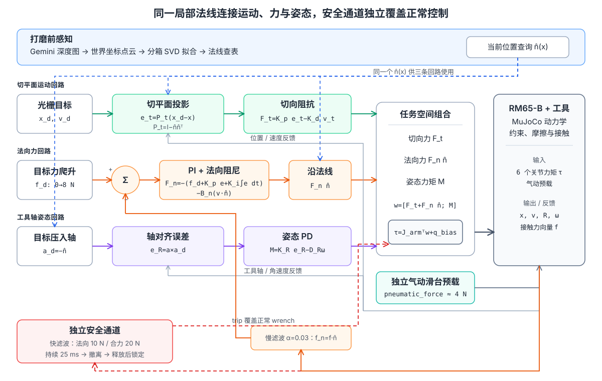

此外，气动滑台的 `pneumatic_force` 是独立的第 7 路执行器命令。它不是第 7 个机械臂关节的力矩，而是轴向预载。

为了看清每个子系统，下面再把感知、法向力和切平面位置三部分拆开。感知管线只在打磨开始前跑一次，产出按 $`x`$ 查法线的表：

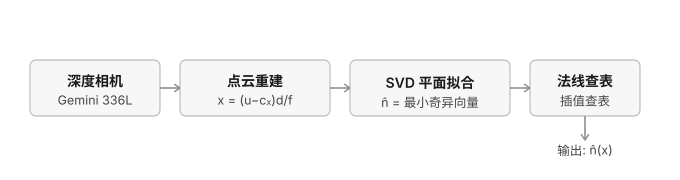

法向力回路——$`\hat{\mathbf n}(x)`$ 从感知管线输入，决定“沿哪个方向压”。实线是经过慢滤波的正常反馈回路；虚线是独立安全监督，它在跳闸时覆盖控制器输出，但**不返回误差求和点**：

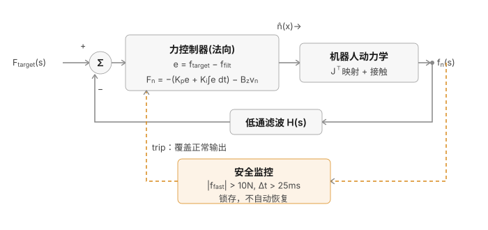

切平面位置回路——跟法向力回路结构上完全并联，只是把 PI 换成阻抗律，反馈的是直接测量的位置（不需要低通滤波，因为位置测量没有接触求解器那种数值毛刺）：

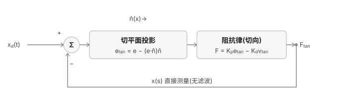

两个回路的输出 $`F_{\text{normal}}`$、$`F_{\text{tangent}}`$ 在送进 $`J^\mathsf T`$ 之前直接相加：$`F_{\text{task}}=F_{\text{normal}}+F_{\text{tangent}}`$——这一步能直接相加、不用再额外处理耦合，正是因为 2.3 节那两个投影矩阵满足 $`P_nP_t=0`$，两者严格正交。

框图里最容易被忽略的一点，是红色虚线不能叫作“安全反馈外环”。$`H(s)`$（慢滤波）是真正的线性传递函数，正常力回路可以讨论带宽和稳定性；2.4 节的安全状态机则执行“快滤波超阈值、持续 25 ms、触发后锁存”的带记忆开关逻辑。它没有对应的线性 $`G(s)`$，不能和正常反馈回路一起做框图化简。

### 2.3 局部法线为什么是系统的核心接口

点云输出的单位法线 $`\hat{\mathbf n}`$ 被同一控制步中的三个模块共同使用：

1. 工具姿态：砂盘压入轴对准 $`-\hat{\mathbf n}`$；
2. 力控制：测量力投影为 $`f_n=\mathbf f^\mathsf T\hat{\mathbf n}`$，命令力沿法线施加；
3. 运动控制：位置误差和速度投影到切平面。

对应的投影矩阵为：

$$
P_n=\hat{\mathbf n}\hat{\mathbf n}^{\mathsf T},
\qquad
P_t=I-P_n.
$$

因为 $`P_nP_t=0`$，理想情况下法向力环和切平面位置环不会在同一方向争夺控制权。

### 2.4 正常控制环和安全环不是一回事

接触力同时进入两套不同目的的通道：

```text
原始法向力 ─→ 慢滤波 alpha=0.03 ─→ PI 跟踪 8 N
            └→ 快滤波 alpha=0.2  ─→ 10 N 持续过力监控

原始接触力向量 ─→ 模长 ─→ 快滤波 ─→ 20 N 合力兜底
```

慢滤波是为了稳定控制；快滤波是为了尽快识别危险。把快信号直接用于 PI 会重新引入抖动，把慢信号用于安全又会反应太迟。

安全状态机为：

```text
POLISHING
  └─ 法向快滤波 > 10 N 或合力快滤波 > 20 N，持续 25 ms
       ↓
RETREATING：沿 +n 施加撤离力
  └─ 接触力 < 2 N
       ↓
FAULT_LATCHED：保持释放位置，不自动恢复
```

### 2.5 每个物理时间步发生什么

每一步大致按以下顺序执行：

1. 从 `MjData` 读取关节状态、TCP 位姿和当前接触；
2. 计算 6×6 手臂雅可比，同时用完整雅可比计算包含气动滑台的 TCP 速度；
3. 根据 TCP 的 $`x`$ 位置查询预扫描法线；
4. 读取接触力，更新慢滤波、快滤波和合力通道；
5. 更新安全状态；
6. 计算姿态力矩；
7. 根据当前阶段执行接近、混合打磨或安全撤离/锁定控制；
8. 组合六维 wrench，通过 $`J^\mathsf T`$ 变成关节力矩；
9. 加上 `qfrc_bias`，执行力矩限幅；
10. 调用 `mj_step()` 推进物理世界并记录日志。

这张地图是后续各章的依赖骨架：物理模型决定“系统能怎样动”，控制理论决定“希望怎样动”，感知提供表面坐标系，安全逻辑决定异常时是否允许继续。

---
## 第二部分　物理模型、工件与任务轨迹

## 第三章　当前 RM65-B 与气动柔顺末端模型

### 3.1 为什么先读物理模型

同一套控制公式放在不同机器人和末端上，表现可能完全不同。关节力矩上限、工具长度、气动滑台刚度、阻尼和行程都会改变闭环动力学。因此，当前模型不是控制器之外的“外观素材”，而是控制系统的一部分。

### 3.2 六轴 RM65-B 的直接力矩执行器

`rm65b_pneumatic.xml` 定义 6 个旋转关节和 6 个 `<motor>`：

```xml
<motor name="actuator1" joint="joint1" ctrlrange="-60 60"/>
<motor name="actuator2" joint="joint2" ctrlrange="-60 60"/>
<motor name="actuator3" joint="joint3" ctrlrange="-30 30"/>
<motor name="actuator4" joint="joint4" ctrlrange="-10 10"/>
<motor name="actuator5" joint="joint5" ctrlrange="-10 10"/>
<motor name="actuator6" joint="joint6" ctrlrange="-10 10"/>
```

直接力矩执行器意味着 `data.ctrl` 中对应的数值直接作为关节力矩使用，而不是先交给一个隐藏的位置伺服器。只有这样，Python 中的任务空间阻抗和显式力控才真正拥有底层控制权。

六轴机械臂的任务空间雅可比在非奇异位形附近是 6×6。它可以同时约束三维位置和三维姿态，但没有多余自由度绕开障碍或优化肘部姿态。当前代码因此不再强行控制圆形砂盘绕自身轴的 yaw，只控制压入轴与法线对齐，避免不必要的腕部翻转。

### 3.3 法兰方向不能靠猜

厂商 Link6 网格位于法兰平面的负侧，因此工具从 Link6 的 (+z) 方向伸出。模型中先放置法兰适配器，再串联气动工具安装体、滑台、背盘和接触代理。若把正负方向写反，工具会穿进腕部或朝远离工件的方向伸出；这类错误不是调控制增益能够修复的。

### 3.4 气动滑台：机械柔顺与主动预载

核心 XML 为：

```xml
<joint name="tool_compliance" type="slide" axis="0 0 1"
       range="-0.008 0.012" stiffness="1200" damping="55"
       springref="0" armature="0.05"/>

<motor name="pneumatic_force" joint="tool_compliance" ctrlrange="0 20"/>
```

它表达了四件事：

- 滑台只能沿工具轴移动；
- 位移限制为 $`-8`$ 到 $`+12\,\mathrm{mm}`$；
- 弹簧刚度为 $`1200\,\mathrm{N/m}`$；
- 阻尼为 $`55\,\mathrm{N\,s/m}`$，另有 $`0\text{--}20\,\mathrm{N}`$ 气动执行器。

因此，接触链为：

```text
关节力矩 → Link6 → 气动预载 + 滑台弹簧阻尼 → 背衬砂盘 → 工件
```

气缸输出的 4 N 不会原样变成工件上的 4 N，因为中间还有滑台弹簧、阻尼、惯性和接触动力学。外层力环必须相信实际接触力反馈，而不是把“气动命令”等同于“工件受力”。

### 3.5 背盘外观和接触代理为什么分开

`pad_visual` 是半径 $`25\,\mathrm{mm}`$ 的完整背盘，用来展示真实尺寸和计算覆盖范围；`pad_geom` 是中央小球形接触代理，用来获得稳定的单区域接触。

如果让一个刚性 50 mm 圆盘的整个边缘同时参与 MuJoCo 碰撞，弯曲表面上会出现大量接触点，刚性接触求解可能产生跳变和数值抖动。中央柔顺代理不是说真实砂盘只有中间一点接触，而是把柔性背衬的分布接触等效为更容易控制的局部接触模型。

### 3.6 TCP 为什么不等于砂盘最低点

当前 `tcp_site` 与接触代理最低点存在约 $`14\,\mathrm{mm}`$ 偏移，因此接近阶段目标高度使用：

$$
z_{\mathrm{contact,TCP}}
=z_{\mathrm{surface}}+0.014.
$$

早期版本曾把 TCP 直接压到工件表面高度，相当于让砂盘几何体先穿入工件，再切换力控，造成不必要的冲击。正确的接近目标必须从具体几何关系推导。

### 3.7 速度为什么必须包含滑台自由度

关节力矩映射只使用 6 个机械臂关节的雅可比：

```python
J = J_full[:, arm_dof_idx]
tau_task = J.T @ F_task
```

但 TCP 实际速度使用：

```python
vel6 = J_full @ data.qvel
```

因为 `data.qvel` 还包含 `tool_compliance`。如果速度计算只保留 6 个手臂关节，砂盘在滑台上弹跳时控制器会误以为 TCP 没有法向速度，阻尼项因此失效。

> **检查点**：为什么气动滑台既是好事又可能成为风险？它能吸收几何误差和冲击，但撞到行程限位后机械柔顺会突然“用完”，系统接近刚性接触。

---
## 第四章　MuJoCo 基础：状态、时间步、接触与高度场

本章只保留理解当前系统必需的 MuJoCo 概念。Python/NumPy 语法不再阻塞主线，统一放在附录 A。

### 4.1 MjModel 和 MjData：静态定义 vs 动态状态

MuJoCo 把一个仿真世界拆成两部分：`MjModel` 存的是"永远不变的东西"——机械臂有几个关节、每个关节的质量惯量、工件长什么样，这些内容从 XML 文件编译而来，运行过程中基本不会变（除了本项目这样刻意在运行时改写 `hfield` 数据）。`MjData` 存的是"每时每刻都在变的东西"——当前每个关节的角度、速度、接触力、施加的力矩等等。代码里几乎所有函数都同时接收 `model` 和 `data` 两个参数：`model` 告诉你"世界的规则"，`data` 告诉你"世界现在的样子"。

### 4.2 离散时间步循环

MuJoCo 不是连续仿真物理，而是把时间切成很多个微小的格子，每格宽度是 `model.opt.timestep` 秒，每调用一次 `mujoco.mj_step(model, data)`，世界就往前推进一格。本项目没有在 XML 里显式设置 `timestep`，用的是 MuJoCo 的默认值：

$$
\Delta t = 0.002\ \text{s} \quad\Longrightarrow\quad f_{\text{control}} = \frac{1}{\Delta t} = 500\ \text{Hz}
$$

也就是说，本教材后面讲的"控制循环每一帧"，实际的物理时间跨度只有 2 毫秒。

### 4.3 雅可比矩阵与 `mj_jacSite`

机械臂只能直接控制关节角度/角速度，但打磨任务关心的是"打磨头这个点"的位置和力，两者之间的翻译工具就是雅可比矩阵 $`J`$。`mujoco.mj_jacSite(model, data, jacp, jacr, site_id)` 算出：关节角速度每变化 1 个单位，指定 site（本项目里是装在打磨头上的 `tcp_site`）的位置和姿态角速度分别变化多少：

$$
\begin{bmatrix} \dot{x} \\ \omega \end{bmatrix} = J \, \dot{q}, \qquad J \in \mathbb{R}^{6\times 7}
$$

$`J`$ 后面会被用两次：一次把关节速度转成末端速度（读状态），一次把末端力转成关节力矩（下达指令）——这两次用法方向正好相反，第七章和第十章会讲为什么。

### 4.4 `qfrc_bias`：重力和科氏力前馈

机械臂本身有重量，光是"扛住自己"就需要一部分力矩，这部分跟任务毫无关系的力矩如果不单独处理，会让控制器的响应变得又慢又不准。MuJoCo 每一步自动帮你算好了这部分力矩，存在 `data.qfrc_bias` 里。

### 4.5 高度场（hfield）：程序化生成的地形

`hfield` 是 MuJoCo 用来表示"凹凸不平的地形"的几何体，本质是一个二维网格，每个网格点存一个高度值（归一化在 $`[0,1]`$ 之间），MuJoCo 在采样点之间插值出连续曲面。关键点：`hfield` 的形状定义分两部分——"网格多大、多密"写在 XML 里（`size`、`nrow`、`ncol`），"每个网格点具体多高"是在 Python 运行时用代码算出来再填进去的（`model.hfield_data` 数组）。第五章会详细展开。

### 4.6 `mj_contactForce`：查询接触力

MuJoCo 每一步自动计算所有几何体之间的接触，存在 `data.contact` 数组里（数量是 `data.ncon`）。要拿到某个具体接触点上的力，调用 `mujoco.mj_contactForce(model, data, i, force6)`，返回的是接触局部坐标系下的 $`[f;\ \tau]`$，还需要用接触帧的旋转矩阵转回世界坐标系。

---
## 第五章　工件几何：平面与真圆弧为什么必须相切

工件表面设计成"一半平面、一半圆弧"，是为了在同一个仿真里同时演示位置控制（平面上打磨轨迹仍然是显式给坐标）和第八章讲的"力控制不需要知道精确高度"这个特性。

### 5.1 相切条件：为什么交界处看不出折角

`fill_workpiece_hfield()` 生成这个曲面。先看完整函数，逐个变量交代清楚它是什么、从哪来（按名字查询 MuJoCo 对象的基础方法见附录 A）：

```python
def fill_workpiece_hfield(model):
    hid = model.hfield("workpiece_hf").id      # 按名字查到这个 hfield 的编号
    nrow = model.hfield_nrow[hid]               # 网格有多少行（沿 y），本项目里是 4
    ncol = model.hfield_ncol[hid]               # 网格有多少列（沿 x），本项目里是 200
    adr = model.hfield_adr[hid]                 # 这个 hfield 的数据在 model.hfield_data
                                                 # 这个大数组里，从第几个位置开始存
    x_half = model.hfield_size[hid][0]          # XML size 属性的第 1 个数：x 方向半宽
    elevation = model.hfield_size[hid][2]       # XML size 属性的第 3 个数：最大附加高度

    xs_local = np.linspace(-x_half, x_half, ncol)      # 200 个点，均匀铺满 [-x_half, x_half]
    s = np.clip(xs_local, 0.0, ARC_RADIUS)             # x<=0 时保持平坦（见附录 A np.clip）
    height_above_flat = ARC_RADIUS - np.sqrt(ARC_RADIUS ** 2 - s ** 2)
    profile = np.clip(height_above_flat / elevation, 0.0, 1.0)  # 归一化到 hfield 要求的 [0,1]
    model.hfield_data[adr:adr + nrow * ncol] = np.tile(profile, (nrow, 1)).flatten()
```

一步步看：`model.hfield("workpiece_hf")` 和 `model.hfield_nrow`/`model.hfield_ncol`/`model.hfield_adr`/`model.hfield_size` 都是 MuJoCo 提前编译好、按 `hid` 这个编号去查的数组（同一套"按名字先查编号、再用编号查数组"的模式，`x_half`、`elevation` 直接对应 XML 里 `<hfield size="0.18 0.18 0.04 0.05"/>` 这四个数字的第 1、第 3 个）。`xs_local` 是沿 x 方向 200 个采样点的坐标；`s` 把负半轴（平面区）压平到 0（见附录 A `np.clip`）；算出来的 `profile` 是一条长度 200 的一维曲线，只描述了"沿 x 方向"的高度变化。最后一行用 `np.tile` 把这条一维曲线复制 `nrow`（4）份叠成一个 4×200 的网格（因为设计上沿 y 方向高度不变，见附录 A），再用 `.flatten()` 拉平成一维（见附录 A），写进 `model.hfield_data` 这个大数组里从 `adr` 开始、长度 `nrow*ncol` 的那一段——这就是"往 hfield 里灌数据"的完整过程。

把最后 4 行单独写成数学形式，设 $`s`$ 是从交界点往右的距离（$`s = \max(x_{\text{local}}, 0)`$）：

$$
h(s) = R - \sqrt{R^2 - s^2}, \qquad 0 \le s \le R
$$

这是标准圆方程 $`(x-x_c)^2+(z-z_c)^2=R^2`$ 的一个变形，把交界点选在圆心正下方（圆弧的**最低点**），下图把这个构造画了出来：

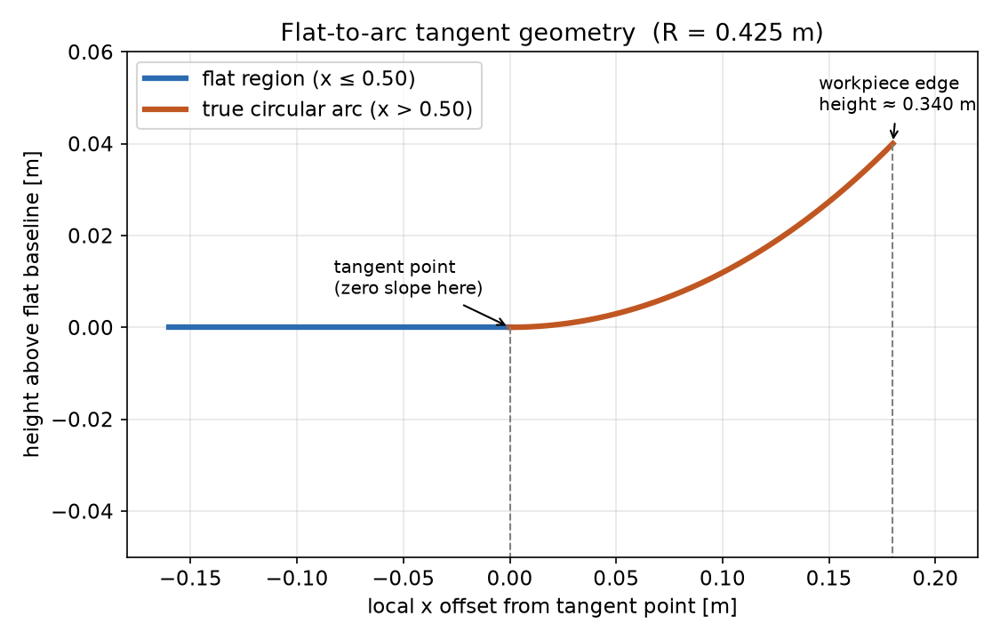

蓝色是平面，橙色是圆弧，两条虚线标出了圆心的位置——圆心在曲面**上方** $`R`$ 处（注意：这里容易直觉搞反——因为我们只画了 $`s\ge 0`$ 这一半、而且它看起来像"从平面往上翘"，很容易误以为交界点是"最高点"；但完整画出整个圆会发现，圆心在上方，交界点是圆弧上离圆心最远、朝下的那一点，也就是**最低点**，往两边走高度都会增加，这正是第二个条件成立的原因）。这样选择能同时满足两个条件：

1. **高度连续**：$`s=0`$ 时 $`h(0) = R - R = 0`$，跟平面高度严丝合缝地对上。
2. **斜率连续（这才是"相切"的真正含义）**：因为交界点被设计成圆弧的最低点，那一点的切线本来就是水平的，跟平面的斜率（0）完全一致。

$$
\left.\frac{dh}{ds}\right|_{s=0} = \left.\frac{s}{\sqrt{R^2-s^2}}\right|_{s=0} = 0
$$

高度对上只保证"不会有台阶"，斜率也对上才能保证"肉眼看不出折角"——一段圆弧只有在它的最高点或最低点才会有零斜率，选别的点做交界（比如圆弧的"侧面"），那一点的切线是斜的甚至是竖直的，跟平面的水平切线对不上，一定会有某种程度的折角。

### 5.2 数值算例

当前参数区给出 `ARC_RADIUS = 0.425`（m）、`ARC_ELEVATION = 0.04`（m，即 hfield 的 `elevation_z`）。代入公式：

| 世界坐标 $`x`$（m） | 局部坐标 $`s`$（m） | 高度（m） | 说明 |
|---|---|---|---|
| 0.32 | —（平面区） | 0.30 | 工件左边缘，纯平面 |
| 0.50 | 0.00 | 0.30 | 平面/圆弧交界，相切点，斜率为 0 |
| 0.55 | 0.05 | ≈0.303 | 圆弧区，刚开始爬升，很缓 |
| 0.60 | 0.10 | ≈0.312 | 圆弧区，继续爬升 |
| 0.65 | 0.15 | ≈0.327 | 圆弧区，接近工件右边缘 |
| 0.68 | 0.18 | ≈0.34 | 工件右边缘，圆弧直接在此结束，不再变平 |

注意最后一行——按照"然后结束"的设计要求，圆弧在工件边缘直接终止，不会再变回平面。`s = np.clip(xs_local, 0.0, ARC_RADIUS)` 这行代码保证了只要 `xs_local` 不超过 `ARC_RADIUS`，圆弧公式就会一直生效到工件边缘。

### 5.3 为什么用高度场而不是拼几何体

开发过程中实际尝试过用"一个方块（平面）+ 一个侧躺的圆柱体（凸起）"拼接的方案，问题是：要让圆柱体的凸起和方块的平面"相切"，圆柱体的切点必须是它的最高点，而最高点两侧的高度都会下降——凸起过了顶点之后会往下掉，没法一直单调爬升到工件边缘。要同时做到"相切 + 单调爬升 + 在边缘直接结束"，用程序化生成的高度场直接套用 5.1 节的公式，比拼接固定几何体灵活得多。

> **检查点**：如果把交界点选在圆弧的"侧面"（既不是最高点也不是最低点）而不是最低点，高度和斜率还能同时对上吗？（答案：不能——侧面点的切线是斜的（极端情况下是竖直的），跟平面的水平切线对不上，会有明显的折角。）

---

## 第六章　13 道全覆盖光栅：目标轨迹不等于实际覆盖

### 6.1 为什么要用往复式光栅

固定小圆只能反复加工局部区域，不能证明系统具备整面覆盖能力。当前轨迹采用 boustrophedon（牛耕式）扫描：每一行沿 $`y`$ 往返，完成一行后沿 $`x`$ 移到下一行，相邻行方向相反。

### 6.2 当前参数

```python
RASTER_X_MIN, RASTER_X_MAX = 0.345, 0.655
RASTER_Y_MIN, RASTER_Y_MAX = -0.169, 0.169
RASTER_ROWS = 13
RASTER_SWEEP_TIME = 4.5
RASTER_END_DWELL = 1.0
RASTER_ROW_PERIOD = RASTER_SWEEP_TIME + RASTER_END_DWELL
RASTER_TRANSITION_TIME = 0.25
```

工件边界为 $`x=0.32\text{--}0.68\,\mathrm{m}`$、$`y=\pm0.18\,\mathrm{m}`$。$`x`$ 方向按 25 mm 砂盘半径内缩；$`y`$ 方向只内缩 11 mm，使背盘在换向边缘外伸约 14 mm，以补偿动态跟踪误差并完成边缘加工。

13 行在 $`x`$ 方向形成约 $`25.8\,\mathrm{mm}`$ 的中心间距。对直径 50 mm 的砂盘而言，相邻条带约有 48% 重叠，不会留下未加工缝隙。

### 6.3 时间如何变成行号和行内进度

```python
row = min(int(t_polish // RASTER_ROW_PERIOD), RASTER_ROWS - 1)
t_in_row = t_polish - row * RASTER_ROW_PERIOD
row_t = np.clip(t_in_row / RASTER_SWEEP_TIME, 0.0, 1.0)
```

`//` 得到已经完成的整行数量；`t_in_row` 表示当前行已经走了多久；`row_t` 把有效扫程归一化到 0 到 1。端点停留期间 `row_t` 被夹在 1，因此位置保持在边缘。

### 6.4 两个平滑机制

第一，行内 $`y`$ 使用 smoothstep：

$$
s(u)=u^2(3-2u).
$$

它满足 $`s(0)=0,s(1)=1,s'(0)=s'(1)=0`$，因此砂盘在端点自然减速到零，而不是瞬间反向。

第二，换行时的 $`x`$ 位移在 $`0.25\,\mathrm{s}`$ 内线性过渡，避免目标横向跳变。随后 1 秒端点停留给阻抗弹簧时间追上目标，降低快速扫程带来的滞后。

### 6.5 交替方向

```python
if row % 2 == 0:
    y = RASTER_Y_MIN + (RASTER_Y_MAX - RASTER_Y_MIN) * row_t_smooth
else:
    y = RASTER_Y_MAX - (RASTER_Y_MAX - RASTER_Y_MIN) * row_t_smooth
```

偶数行从负 $`y`$ 走到正 $`y`$，奇数行反向。这样上一行的终点就是下一行的起点附近，不需要空程回到同一侧。

### 6.6 为什么目标轨迹不能证明覆盖

机械臂存在跟踪误差，砂盘又具有有限半径，因此必须从实际日志检查：

- 实际 TCP 的 $`x/y`$ 最小值和最大值；
- 加上 25 mm 半径后的砂盘 footprint；
- 每一行单独的边缘覆盖，而不仅是所有行合在一起的全局极值。

当前代表性结果中，全局砂盘实际覆盖约为 $`x=0.3018\text{--}0.6809\,\mathrm{m}`$、$`y=-0.1935\text{--}0.1872\,\mathrm{m}`$。逐行最差的 $`y`$ 覆盖仍超过工件的 $`\pm0.18\,\mathrm{m}`$ 边界。

> **边界情况**：增加行数通常会减小条带间距，但不能自动解决可达性、跟踪滞后或奇异位形。覆盖率必须用实际轨迹验收。

---
## 第三部分　从控制理论到当前代码

## 第七章　阻抗控制理论：弹簧-阻尼类比

阶段 1（下降）以及阶段 2 里的 x、y 方向，用的都是同一种控制思路——阻抗控制（impedance control）。核心比喻：把机械臂末端想象成一个弹簧连着一个阻尼器，"哪里该去，就用弹簧的力把它拉过去"，而不是强行命令关节转到某个精确角度。

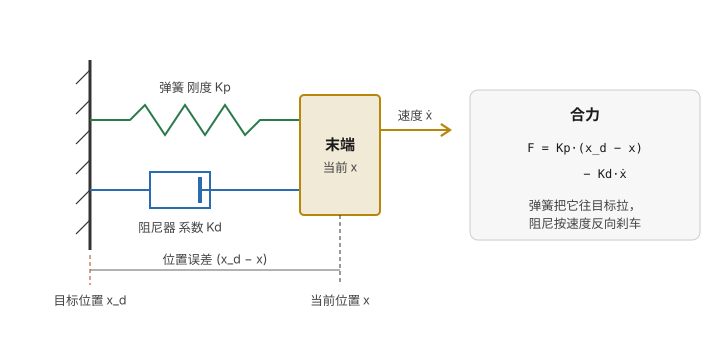

看这张图：左边墙壁代表目标位置 $`x_d`$（弹簧和阻尼器的另一端锚在这里），右边滑块代表机械臂末端当前位置 $`x`$。弹簧（绿色）按"拉伸了多少"产生把滑块往目标拉的力；阻尼器（蓝色，像个注射器活塞）按"滑块动得多快"产生反向的阻力。两者合起来就是下面的公式。

### 7.1 基本公式

$$
F = K_p \left(x_d - x\right) - K_d \, \dot{x}
$$

第一项 $`K_p(x_d - x)`$ 是弹簧力：$`(x_d - x)`$ 是"目标减当前"的位置误差，误差越大、拉力越大，$`K_p`$ 是弹簧刚度（单位 N/m，越大弹簧越"硬"、拉得越猛）。第二项 $`-K_d\dot{x}`$ 是阻尼力：$`\dot x`$ 是当前速度，速度越快、反向阻力越大（前面的负号表示"总是跟运动方向相反"），$`K_d`$ 是阻尼系数，作用是防止弹簧像蹦极一样反复振荡个不停。对应到代码里，第十章 10.6 节阶段一 那三行 `KP_POS_XY[0] * pos_err[0] - KD_POS_XY[0] * x_dot[0]` 就是这个公式在 x/y/z 三个方向各写了一遍。阶段 2 里的 `F_tangent = KP_POS_XY[0] * pos_err_tan - KD_POS_XY[0] * v_tan`（第十章 10.7 节）是**同一个公式**，只是 $`e`$ 和 $`\dot x`$ 换成了投影到局部切平面之后的版本——弹簧-阻尼这套比喻本身没有变，变的只是"弹簧钉在哪个子空间里"。

### 7.2 为什么 $`K_d = 2\sqrt{K_p}\,\zeta`$

当前切向阻抗参数为：

```python
KP_POS_XY = np.array([400.0, 400.0])
KD_POS_XY = 2.0 * np.sqrt(KP_POS_XY) * 1.0
```

这个公式来自二阶系统的**临界阻尼**条件。设 $`\zeta`$ 为阻尼比：

$$
K_d = 2\sqrt{K_p}\,\zeta
$$

$`\zeta=1`$ 时系统"临界阻尼"——最快到达目标且不振荡；$`\zeta<1`$（欠阻尼）会振荡但响应快；$`\zeta>1`$（过阻尼）不振荡但迟钝。下图用同一个 $`K_p=100`$ 分别代入三种 $`\zeta`$，直接把这个抽象的公式变成能看见的曲线：

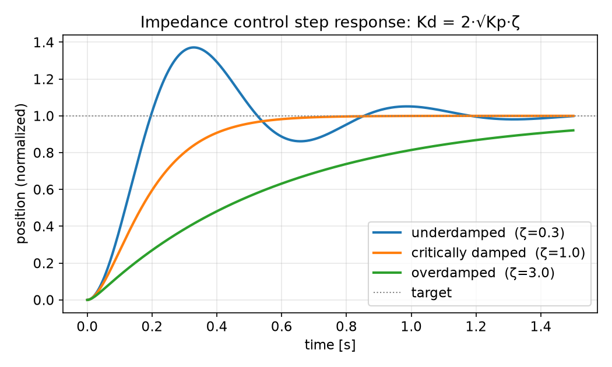

蓝色线（$`\zeta=0.3`$）明显冲过目标又弹回来，反复振荡才收敛；橙色线（$`\zeta=1.0`$）以最快速度贴到目标附近且几乎没有超调；绿色线（$`\zeta=3.0`$）慢吞吞地爬向目标，1.5 秒还没到位。这跟你在 robosuite `OSC_POSE` 源码里看到的 `kd = 2*sqrt(kp)*damping_ratio` 是完全同一个公式。

### 7.3 数值算例

为了便于手算，假设 `KP_POS_XY=100`，某一时刻 x 方向的位置误差是 0.05 m，此刻末端在 x 方向的速度是 0.1 m/s：

$$
K_d = 2\sqrt{100} = 20
$$
$$
F_x = 100 \times 0.05 - 20 \times 0.1 = 5.0 - 2.0 = 3.0\ \text{N}
$$

这一瞬间控制器会通过 $`J^\top`$ 把这 3 牛顿的期望末端力转换成关节力矩指令。误差越小、速度越接近 0，这个力就越接近 0——这正是"弹簧"的行为。

### 7.4 姿态和下降阶段的 z 轴，同一套逻辑

当前参数区的 `KP_ROT`/`KD_ROT`（姿态）和 `KP_POS_Z_APPROACH`/`KD_POS_Z_APPROACH`（下降阶段专用的 $`z`$ 轴刚度）用的是完全相同的公式，只是应用在不同的物理量上——姿态误差属于 $`\mathfrak{so}(3)`$ 上的旋转误差，当前代码以压入轴叉乘作小角度近似，本质还是“误差 × 刚度 − 角速度 × 阻尼”。姿态控制的**目标**（第十章 10.5 节）会实时变化，但控制**律**本身没有变。

> **常见误解**：阻抗控制会"自动"适应任何任务规模。——不会，见第十三章。$`K_p`$、$`K_d`$ 是针对特定任务的空间尺度和速度手调出来的常数。

---

## 第八章　显式力控制理论：为什么控制方向必须是表面法线，而不是世界 $`z`$ 轴

### 8.1 核心问题：你不知道工件表面的精确高度

阶段 2（打磨）里，切平面方向依然用阻抗控制去跟踪一个目标坐标，但法线方向（垂直压向工件的方向）完全不一样——代码里根本没有一个变量代表"法线方向应该压到哪个坐标"。当前代码用下面这行日志约定表达同一事实：

```python
z_d_log = x_cur[2]  # no explicit z setpoint in force-control phase
```

如果给这个方向一个目标坐标（比如"压到 0.30 米"），等于赌你对工件表面高度的估计完全精确。真实表面比估计的**高**，机械臂会继续下压穿过"目标高度"，接触力无限增大；真实表面比估计的**低**，机械臂还没碰到工件就"到达目标位置"了，接触力是 0，等于没有打磨。本项目里这个问题被刻意放大：工件表面有一段真圆弧，高度从 0.30 m 一路爬升到约 0.34 m（第五章）。如果这个方向用位置控制，你需要精确知道曲面在每个 x 位置的高度；显式力控制完全不需要知道这些——它只关心一个数：接触力传感器的读数。

### 8.2 力控制律

忽略力爬升、命令限幅和安全分支后，核心力控制结构为：

```python
f_err = F_TARGET - f_filt
f_integral = np.clip(f_integral + f_err * dt, -I_CLAMP, I_CLAMP)
vn = x_dot @ n
Fn_cmd = -(F_TARGET + KP_F * f_err + KI_F * f_integral) - BZ * vn
F_normal = Fn_cmd * n
```

写成数学形式（$`e = f_{\text{target}} - f_{\text{filt}}`$，$`\hat n`$ 是 第十章 10.3 节查询的局部表面法线单位向量）：

$$
\vec F_{\text{normal}} = \underbrace{-\left(f_{\text{target}} + K_{p,f}\, e + K_{i,f} \!\int e\, dt\right) - B_z\, (\dot{\vec x}\cdot\hat n)}_{F_n^{\text{cmd}},\ \text{标量}} \;\hat n
$$

这是一个 PI（比例-积分）控制器加一个纯阻尼项，跟旧版本相比**公式结构完全没变**，只是三处标量替换了度量对象：$`f_{\text{target}}`$ 是目标力（本项目 8 N）的前馈项；$`K_{p,f}\, e`$ 是比例项，力误差越大修正越大（`f_filt` 现在是投影到法线方向的滤波力，见第十章 10.3 节）；$`K_{i,f}\!\int e\, dt`$ 是积分项，专门消除长期偏差；$`-B_z (\dot{\vec x}\cdot\hat n)`$ 是纯阻尼，抑制的是末端速度**沿法线方向的分量** `vn`，而不是旧版本里的世界系 `x_dot[2]`。算出来的 `Fn_cmd` 是一个标量（"沿法线方向该用多大的力"），最后 `* n` 把它撑开成一个真正的 3 维力向量 `F_normal`——这一步在旧版本里是隐含的（`Fz_cmd` 本来就只填在 z 分量上，等价于隐式地乘以 `(0,0,1)`），现在因为 `n` 会随位置变化，必须显式写出来。

### 8.3 抗积分饱和：`I_CLAMP`

如果长时间跟不上目标力，积分项会不断累加、越变越大，一旦突然跟上会因为过大的积分值产生剧烈超调。参数 `I_CLAMP=15.0` 把积分项限制在 $`[-15, 15]`$ 以内——PI/PID 控制器里的标准技巧，叫抗积分饱和（anti-windup）。

### 8.4 最关键的一课：不要在同一个方向上混用位置刚度和力积分

这是项目 README 里专门强调的教训。设想在阶段 2 的法线方向上，除了力控制公式，还额外保留了一份"位置刚度"项——位置刚度说"再往下压一点"，力积分说"已经压得够了往回缩"，两个闭环在同一个方向、同一时刻，针对同一个物理量（法向压深）分别给出指令，且方向经常相反。这两股力会互相打架，叠加出振荡——项目作者真实遇到过这个问题，现象是接触力在 -70N 到 0N 之间反复跳变。修复方法：法线方向的打磨阶段只用纯力指令 + 阻尼项，不保留任何位置刚度成分。

> 可以推广成一句话：**同一个自由度方向上，位置控制和力控制不能同时“抢主导权”**，要么整个方向归位置控制管，要么归力控制管，两者的输出不能简单相加。这条结论现在推广到了整个法线方向，而不再局限于世界 $`z`$ 轴——下一节会说明为什么世界 $`z`$ 轴只在平面上才是正确近似。

### 8.5 为什么控制方向不能是世界 $`-z`$，而必须是局部法线

前面几节都在讲“为什么力控制该用力反馈而不是位置”，但还有一个更基础的问题：**该用哪个方向的力反馈？** 本项目最早的版本会不假思索地说“当然是 $`z`$ 方向，往下压”——在纯平面区域这没问题，因为法线正好是世界 $`+z`$；但在圆弧区域，真实表面法线已经倾斜，世界 $`-z`$ 和局部法线的反方向不再重合，混用它们会引入系统性压力偏差。

**推导这个偏差有多大。** 假设接触力矢量确实沿着真实的表面法线 $`\hat n`$（打磨接触通常摩擦分量很小，法向分量占主导，这是一个合理近似），大小为 $`f_n`$：

$$
\vec f_{\text{raw}} = f_n\, \hat n
$$

旧版本只读世界 z 分量 `f_raw[2]`，也就是这个矢量在世界 $`\hat z`$ 方向上的投影：

$$
f_{z,\text{raw}} = \vec f_{\text{raw}} \cdot \hat z = f_n\,(\hat n \cdot \hat z) = f_n \cos\theta
$$

其中 $`\theta`$ 是局部法线 $`\hat n`$ 相对世界竖直方向的倾角（圆弧区域越往边缘走，$`\theta`$ 越大，见第十一章 11.5 节的验证数据，最大约 $`20.9^\circ`$）。控制器把 `f_z_raw` 调节到 `F_TARGET`，也就是让 $`f_n \cos\theta = F_{\text{target}}`$，反解出**真实**法向力：

$$
f_n = \frac{F_{\text{target}}}{\cos\theta} > F_{\text{target}}
$$

因为 $`\cos\theta < 1`$，真实压力永远比目标值大——这就是本次改造要修掉的"$`1/\cos\theta`$ 过压偏差"：你以为压了 8 N，圆弧上倾角越大的地方实际上压得越狠。而新版本直接把力投影到 $`\hat n`$ 上（`f_raw @ local_normal`，第十章 10.3 节），调节的正是 $`f_n`$ 本身，不存在这个偏差。

**实测数据验证这个推导**：让仿真分别跑一遍"只控制世界 z 分量"（旧版本逻辑）和"控制法线投影分量"（新版本逻辑），在打磨结束后测量**真实法向力**（两种情况下都用 $`\vec f_{\text{raw}} \cdot \hat n_{\text{真值}}`$ 这同一把尺子去衡量，才是公平比较）：

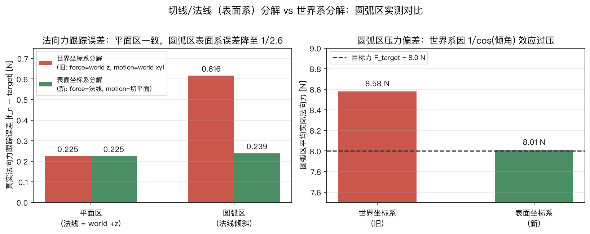

| 区域 | 世界系（旧）真实法向力误差 | 表面系（新）真实法向力误差 |
|---|---|---|
| 平面区（$`\theta=0`$） | 0.225 N | 0.225 N（完全一致，符合预期——平面上 $`\cos\theta=1`$，两种写法代数等价） |
| 圆弧区（$`\theta`$ 最大约 $`20^\circ`$） | 0.616 N | 0.239 N（约 2.6 倍改善） |
| 圆弧区平均实际压力（目标 8.0 N） | 8.58 N（过压 7.3%） | 8.01 N（几乎无偏差） |

数字对得上推导：$`\arccos(8.0/8.58)\approx21.3^\circ`$，和圆弧区域的真实倾角量级（第十一章验证过的约 $`20.9^\circ`$）几乎吻合，说明 8.58 N 这个过压量确实主要来自 $`1/\cos\theta`$ 效应，而不是别的随机误差。

这里还有第二个、容易被忽略的耦合问题：旧版本 xy 阻抗算出的修正力是纯水平方向的；在圆弧区域，由于表面倾斜，这个水平力天然带有一个投影到真实法线方向上的分量——也就是说，旧版本的"xy 阻抗"和"z 力控"这两个本该独立的闭环，在圆弧区域并不正交，会互相轻微干扰（这跟第十三章 13.5 节"刚度和任务尺度不匹配"是两个独立的问题，但方向上是同一类：**世界坐标轴对齐的分解，在倾斜表面上并不是真正正交的分解**）。新版本把力限制在 $`\hat n`$ 上、把运动限制在 $`\hat n`$ 的正交补（切平面）上，这两个子空间在几何上严格正交，无论表面倾斜与否都不会互相泄漏。

### 8.6 切平面投影：为什么两个子空间的力可以直接相加

第十章 10.7 节给出了切平面阻抗的代码：

```python
pos_err_tan = pos_err - (pos_err @ n) * n
v_tan = x_dot - (x_dot @ n) * n
F_tangent = KP_POS_XY[0] * pos_err_tan - KD_POS_XY[0] * v_tan
```

`pos_err - (pos_err @ n) * n` 是线性代数里标准的"减去投影"技巧：`(pos_err @ n) * n` 是 `pos_err` 落在 $`\hat n`$ 方向上的那一部分（一个标量乘以单位向量），原向量减掉它，剩下的部分必然与 $`\hat n`$ 垂直——这是因为任何 3 维向量都可以唯一分解成"沿 $`\hat n`$" 和"垂直于 $`\hat n`$"两部分之和，这两部分互不重叠。`v_tan` 对速度做同样的操作。

`F_xyz = F_normal + F_tangent`（第十章 10.7 节）之所以可以直接相加而不用担心两者互相抵消或产生意料之外的耦合，正是因为 `F_normal` 严格躺在 $`\hat n`$ 方向上、`F_tangent` 严格躺在垂直于 $`\hat n`$ 的切平面里——把 3 维力空间正交分解成"1 维法线 + 2 维切平面"，分别独立控制后再相加，结果自动等于在完整 3 维空间里同时满足两个约束。在平面区域 $`\hat n=(0,0,1)`$，这个分解精确退化成"z 分量 / xy 分量"的旧写法；在圆弧区域，分解的两个子空间跟着表面一起倾斜，但正交性质永远成立。

---

## 第九章　局部表面坐标系：把力控轴和运动平面严格分开

### 9.1 为什么世界 $`z`$ 与世界 $`xy`$ 只在平面上成立

平面区域的法线是 $`(0,0,1)`$，因此“沿世界 $`z`$ 力控、在世界 $`xy`$ 运动”恰好正确。进入圆弧后，法线具有非零 $`x`$ 分量；若仍控制世界 $`z`$ 分量，真实法向力会被放大为 $`F_z/\cos\theta`$，世界 $`xy`$ 阻抗也会向表面法线泄漏。

### 9.2 法向和切向投影

设单位法线为 $`\hat{\mathbf n}`$。任意向量 $`\mathbf a`$ 的法向分量与切向分量为：

$$
\mathbf a_n=(\mathbf a^\mathsf T\hat{\mathbf n})\hat{\mathbf n},
\qquad
\mathbf a_t=\mathbf a-(\mathbf a^\mathsf T\hat{\mathbf n})\hat{\mathbf n}.
$$

代码对应：

```python
pos_err_tan = pos_err - (pos_err @ n) * n
v_tan = x_dot - (x_dot @ n) * n
```

不能用“把 z 分量设为 0”代替这个公式，因为圆弧上的法线不再和世界 $`z`$ 重合。

### 9.3 合成任务空间力

法向力控制输出：

```python
F_normal = Fn_cmd * n
```

切平面阻抗输出：

```python
F_tangent = KP_POS_XY[0] * pos_err_tan - KD_POS_XY[0] * v_tan
```

最终直接相加：

$$
\mathbf F=\mathbf F_n+\mathbf F_t.
$$

因为两者属于正交子空间，$`\mathbf F_n^\mathsf T\mathbf F_t=0`$。这里的“互不干扰”是几何意义上的解耦，不代表真实机器人动力学完全没有耦合；雅可比、关节惯性、摩擦和执行器限幅仍会造成间接影响。

### 9.4 同一法线的三个消费者

同一控制步只查询一次 `local_normal`，然后同时用于姿态、力投影和切平面投影。若三个模块使用不同来源或不同时刻的法线，控制器会对“表面朝向”产生不一致理解。

### 9.5 平面退化性质

当 $`\hat{\mathbf n}=(0,0,1)`$ 时：

- $`f_n=\mathbf f^\mathsf T\hat{\mathbf n}=f_z`$；
- 切平面投影等价于把 $`z`$ 分量设为 0；
- 工具轴目标退化为固定朝下。

因此，新控制器在平面区域精确退化为早期世界坐标控制。这个性质便于验证：如果平面区域也发生巨大变化，应优先检查实现错误，而不是归因于曲面感知。

---
## 第十章　当前控制循环逐段精读

理论已经建立，现在再读代码。当前循环与早期 Panda 版本最大的不同是：6 个手臂关节、1 个气动滑台自由度、预扫描法线、双安全通道和故障锁定都已进入主循环。

### 10.1 循环外准备

```python
arm_dof_idx = [model.joint(name).dofadr[0] for name in ARM_JOINT_NAMES]
arm_act_idx = [model.actuator(f"actuator{i}").id for i in range(1, 7)]
pneumatic_act_id = model.actuator("pneumatic_force").id
tcp_site_id = model.site("tcp_site").id
pad_geom_id = model.geom("pad_geom").id
```

`arm_dof_idx` 和 `arm_act_idx` 都只有 6 个元素。气动执行器单独保存，不能混进 $`J^\mathsf T\mathbf w`$ 产生的 6 个关节力矩。

随后在控制循环开始前完成一次点云扫描：

```python
scan_points = capture_point_cloud(model, data)
scan_points = scan_points[workpiece_roi]
normal_x_bins, normal_lut = fit_normals_along_x(...)
```

扫描和拟合不是每个 2 ms 控制步都重新执行；实时部分只是根据当前 $`x`$ 插值查表。

### 10.2 雅可比、位姿与包含滑台的 TCP 速度

```python
mujoco.mj_jacSite(model, data, jacp, jacr, tcp_site_id)
J_full = np.vstack([jacp, jacr])
J = J_full[:, arm_dof_idx]

x_cur = data.site_xpos[tcp_site_id].copy()
R_cur = data.site_xmat[tcp_site_id].reshape(3, 3).copy()
vel6 = J_full @ data.qvel
x_dot, omega = vel6[:3], vel6[3:]
```

`J` 用于关节力矩映射，`J_full` 用于得到真实 TCP 速度。两者故意不同，原因是气动滑台能改变 TCP 速度，却没有对应的机械臂旋转关节力矩。

### 10.3 法线、接触力和三种滤波状态

```python
local_normal = estimate_normal_at_x(x_cur[0], normal_x_bins, normal_lut)
f_raw = get_contact_force_on_pad(model, data, pad_geom_id)
f_n_raw = f_raw @ local_normal
f_resultant_raw = np.linalg.norm(f_raw)

f_filt += F_FILT_ALPHA * (f_n_raw - f_filt)
f_fast += F_FAST_ALPHA * (f_n_raw - f_fast)
f_resultant_fast += F_FAST_ALPHA * (f_resultant_raw - f_resultant_fast)
```

三个状态的职责分别是：慢法向力用于 PI；快法向力用于识别过压；快合力在法线估计错误时兜底。

### 10.4 安全判据先于正常控制

```python
if not safety_tripped:
    if f_fast > F_RETREAT_TRIGGER or f_resultant_fast > F_RESULTANT_TRIGGER:
        overforce_time += dt
    else:
        overforce_time = 0.0
```

只有连续超阈值时间达到 $`25\,\mathrm{ms}`$ 才置 `safety_tripped=True`。一旦跳闸，清空力积分，避免旧积分在异常解除后继续压向工件。

### 10.5 姿态只控制压入轴

```python
tool_press_axis = R_cur[:, 2]
desired_press_axis = -local_normal
rot_err = np.cross(tool_press_axis, desired_press_axis)
rot_wrench = KP_ROT * rot_err - KD_ROT * omega
```

圆形砂盘绕自身轴的旋转不改变接触几何，因此不必控制 yaw。对六轴臂强行控制完整三维姿态可能造成不必要的腕部翻转。

### 10.6 阶段一：位置阻抗接近

接近阶段对 $`x,y,z`$ 都使用位置阻抗，并用 smoothstep 把 TCP 从安全高度降到几何接触高度。此时尚未使用法向 PI 力环。

```python
F_xyz = np.array([
    KP_POS_XY[0] * pos_err[0] - KD_POS_XY[0] * x_dot[0],
    KP_POS_XY[1] * pos_err[1] - KD_POS_XY[1] * x_dot[1],
    KP_POS_Z_APPROACH * pos_err[2] - KD_POS_Z_APPROACH * x_dot[2],
])
```

### 10.7 阶段二：局部表面系混合控制

目标力和气动预载先经过 $`1.5\,\mathrm{s}`$ 力爬升：

```python
f_target_cmd = F_TARGET * force_ramp
pneumatic_cmd = PNEUMATIC_PRELOAD * force_ramp
data.ctrl[pneumatic_act_id] = pneumatic_cmd
```

法向 PI 与阻尼：

```python
f_err = f_target_cmd - f_filt
f_integral = np.clip(f_integral + f_err * dt, -I_CLAMP, I_CLAMP)
vn = x_dot @ n
Fn_cmd = -(f_target_cmd + KP_F * f_err + KI_F * f_integral) - BZ * vn
f_max_now = min(F_MAX, f_target_cmd + 1.0)
Fn_cmd = max(Fn_cmd, -f_max_now)
```

负号表示沿 $`-\hat{\mathbf n}`$ 压入表面。动态上限也随力爬升变化，否则虽然目标力从 0 平滑增长，静态 9 N 上限仍可能允许控制器在起始瞬间命令接近 9 N。

切平面阻抗随后计算并与法向力相加。

### 10.8 跳闸后的两个阶段

```python
if safety_tripped:
    if retreating:
        F_xyz = F_RETREAT_FORCE * local_normal
    else:
        hold_err = fault_hold_pos - x_cur
        F_xyz = KP_FAULT_HOLD * hold_err - KD_FAULT_HOLD * x_dot
```

第一阶段沿 $`+\hat{\mathbf n}`$ 离开表面；力降到 2 N 以下后保存释放位置并进入保持。系统不自动恢复光栅和 PI，因为故障源可能仍然存在。

### 10.9 wrench 到关节力矩

```python
F_task = np.concatenate([F_xyz, rot_wrench])
tau_task = J.T @ F_task
tau = tau_task + data.qfrc_bias[arm_dof_idx]
```

最后逐关节按 XML 中的 `ctrlrange` 限幅并写入 `data.ctrl`。随后 `mj_step()` 推进动力学。这里再次强调：Python 只计算命令，接触后的真实运动和力由 MuJoCo 决定。

### 10.10 非预期结构碰撞日志

每步还遍历 `data.contact`，把砂盘—工件之外的接触对打印为 `UNEXPECTED COLLISION`。目前它只是诊断日志，尚未直接接入 `safety_tripped`；原因在第十二章讨论。

---
## 第四部分　感知、鲁棒性与安全

## 第十一章　点云感知与实时相切姿态控制

为了理解感知模块为什么必不可少，先回顾早期原型：打磨头姿态曾被写死成“垂直朝下”的 `R_down`，哪怕工件表面在圆弧区域已经明显倾斜。当前 RM65-B 版本已经让压入轴随局部法线变化，本章反过来完整解释这个法线怎样从深度相机获得，以及为什么控制器不能直接读取 `ARC_RADIUS` 这个只有仿真设计者才知道的参数。

本章拟合出来的 `local_normal` 现在被下游用了**三次**（第十章已经按顺序遇到过，这里先列个清单，方便对照）：① 10.5 节，决定打磨头姿态该往哪个方向倾斜；② 10.3/10.7 节 + 第八章 8.2/8.5 节，决定接触力该往哪个方向投影、力控制该沿哪个方向作用；③ 10.7 节 + 第八章 8.6 节，决定光栅轨迹的位置/速度误差该投影到哪个平面里。本章 11.1-11.5 节讲清楚 `local_normal` 本身是怎么来的（感知管线），11.6 节再回过头总结这三个用途分别错在哪、新在哪。

### 11.1 为什么要用感知，而不是继续用已知曲率

第八章讲过一个核心原则：显式力控制不需要知道精确的位置/几何信息。但姿态控制是另一回事——如果打磨头是一个球形接触点（本项目的 `pad_geom`），姿态偏一点问题不大；但凡打磨头是一块**平的**打磨板，姿态不跟着表面倾斜，压下去就只有边缘接触，而不是整个面贴合。这是"始终垂直"这个简化能不能继续成立的分界线（这一点在你问出"始终垂直还是实时相切"那次讨论里已经点破过）。

要让姿态"实时跟随表面倾斜"，控制器需要知道"我现在这个位置，表面的法线方向是什么"。这个信息可以有两种来源：

1. **直接用设计时写好的公式**（`ARC_RADIUS`、`ARC_ELEVATION`）反推法线——这是"作弊"，只有仿真里、因为你自己设计了这个曲面才能这么干，真实场景里打磨头面对的工件形状往往是未知的或者有加工误差，不可能有一个现成公式告诉你准确的法线。
2. **用一个传感器"看"一遍工件，再从看到的数据里自己算出法线**——这是本章要做的，也是真实系统的做法：先扫描，再工作。

### 11.2 Gemini 336L 深度图与世界坐标点云

当前 `scan_cam` 不是漂浮在工件正上方的抽象相机，而是固定在相机架上的 Gemini 336L 等效模型。`polish_scene.xml` 使用官方外壳 STL，并把深度光学原点放在左 IR 帧对应位置：

```xml
<body name="orbbec_gemini_336l_mount" pos="0.5 0 0.94">
  ...
  <camera name="scan_cam" pos="0.0475 0 -0.016" fovy="55"/>
</body>
```

相机是固定式 eye-to-hand：相机不随机械臂运动，其仿真位姿就是已知的相机到世界坐标外参。真实系统不能直接照抄这个位姿，必须通过标定得到外参。

当前采集尺寸为：

```python
SCAN_IMG_WIDTH = 640
SCAN_IMG_HEIGHT = 480
SCAN_NUM_FRAMES = 4
DEPTH_NOISE_STD = 0.002
```

`capture_point_cloud()` 的主流程如下：

```python
cam_id = model.camera(SCAN_CAM_NAME).id
renderer = mujoco.Renderer(
    model, height=SCAN_IMG_HEIGHT, width=SCAN_IMG_WIDTH)
renderer.enable_depth_rendering()
renderer.update_scene(data, camera=cam_id)
depth_clean = renderer.render().copy()
renderer.close()

noisy_frames = depth_clean[None, :, :] + np.random.normal(
    0.0, DEPTH_NOISE_STD,
    size=(SCAN_NUM_FRAMES, *depth_clean.shape))
depth = np.mean(noisy_frames, axis=0)
```

MuJoCo 深度渲染本身近乎理想，因此代码主动注入独立高斯噪声，再对 4 帧求平均。这不是为了让图像“更好看”，而是为了让感知管线面对接近真实传感器的非理想输入。噪声与多帧平均的定量关系在第十二章展开。

设图像宽高为 $`w,h`$，垂直视场角为 $`\phi_y`$，等效焦距为：

$$
f=\frac{h}{2\tan(\phi_y/2)}.
$$

主点取 $`(c_x,c_y)=(w/2,h/2)`$。对像素 $`(u,v)`$ 和深度 $`d`$，相机坐标为：

$$
\begin{aligned}
x_{\mathrm{cam}}&=\frac{u-c_x}{f}d,\\
y_{\mathrm{cam}}&=-\frac{v-c_y}{f}d,\\
z_{\mathrm{cam}}&=-d.
\end{aligned}
$$

负号来自图像行坐标向下增长，而 MuJoCo 相机沿自身 $`-z`$ 方向观察。NumPy 一次性对全部 $`640\times480=307200`$ 个像素反投影：

```python
us, vs = np.meshgrid(np.arange(w), np.arange(h))
x_cam = (us - cx) / f * depth
y_cam = -(vs - cy) / f * depth
z_cam = -depth
pts_cam = np.stack([x_cam, y_cam, z_cam], axis=-1).reshape(-1, 3)
```

深度大于 `SCAN_MAX_DEPTH` 的远处点先被丢弃。随后使用相机世界位姿把点云变换到世界坐标：

```python
cam_pos = data.cam_xpos[cam_id].copy()
cam_mat = data.cam_xmat[cam_id].reshape(3, 3).copy()
pts_world = pts_cam @ cam_mat.T + cam_pos
```

在进入平面拟合前还要做工件 ROI 裁剪：限制 $`x/y`$ 落在工件 footprint 内，并限制 $`z`$ 位于工件可能高度附近。否则工作台边缘和工件高度台阶会混入每个分箱，SVD 拟合出的最小方向就不再代表工件表面法线。

> **检查点**：仿真里相机外参为什么“天然已知”，真实系统为什么仍必须标定？因为仿真直接提供 `data.cam_xpos/xmat`；真实安装存在装配误差，CAD 位姿不能替代测量外参。


### 11.3 从点云拟合局部法线

`fit_normals_along_x()` 把整块点云沿 $`x`$ 方向切成 `SCAN_NUM_X_BINS=40` 个小窗口，每个窗口内所有点做一次平面拟合。完整代码：

```python
def fit_normals_along_x(points, x_min, x_max):
    bin_centers = np.linspace(x_min, x_max, SCAN_NUM_X_BINS)
    normals = np.zeros((SCAN_NUM_X_BINS, 3))
    last_good = np.array([0.0, 0.0, 1.0])
    for i, xc in enumerate(bin_centers):
        mask = np.abs(points[:, 0] - xc) < SCAN_BIN_HALF_WIDTH
        local = points[mask]
        if local.shape[0] < 8:
            normals[i] = last_good
            continue
        centroid = local.mean(axis=0)
        _, _, vt = np.linalg.svd(local - centroid)
        normal = vt[-1]
        if normal[2] < 0:
            normal = -normal
        normals[i] = normal
        last_good = normal
    return bin_centers, normals
```

逐行拆开：

- `bin_centers = np.linspace(x_min, x_max, SCAN_NUM_X_BINS)`——见附录 A，在工件的 x 范围内均匀取 40 个采样点，每个点是一个"局部窗口"的中心。
- `normals = np.zeros((SCAN_NUM_X_BINS, 3))`——先开一个 40×3 的空表格，准备存 40 个法线向量（每个法线是 3 维）。
- `last_good`——记录"上一次成功拟合出的法线"，初始值设成 $`(0,0,1)`$（垂直朝上，对应平面区域）；如果某个窗口里点数不够（比如相机看不到那个区域），就用上一个成功的结果顶替，避免程序崩溃或者算出乱七八糟的值。
- `for i, xc in enumerate(bin_centers):`——见附录 A，同时拿到"第几个窗口"（`i`，用来往 `normals[i]` 里写结果）和"这个窗口的中心坐标"（`xc`）。
- `mask = np.abs(points[:, 0] - xc) < SCAN_BIN_HALF_WIDTH`——见附录 A布尔掩码：`points[:, 0]` 是点云里所有点的 x 坐标（切片写法见附录 A），跟窗口中心 `xc` 的距离小于 `SCAN_BIN_HALF_WIDTH`（1.2 厘米）的点，掩码记为 `True`。
- `local = points[mask]`——用这个掩码筛出"落在当前窗口里的所有点"，这是一个 N×3 的小点云（N 是这个窗口里点的数量，可能每次都不一样）。
- `if local.shape[0] < 8: ... continue`——如果这个窗口里点太少（少于 8 个），直接跳过这次循环、复用 `last_good`，不去尝试拟合一个不可靠的平面。
- `centroid = local.mean(axis=0)`——计算这 N 个点的质心（几何中心）。`axis=0` 表示"沿着行的方向求平均"，也就是分别对 x、y、z 三列求平均，得到一个 3 维的中心点。
- `_, _, vt = np.linalg.svd(local - centroid)`——先把点集减去质心（"中心化"，让它们分布在原点周围），再做奇异值分解。SVD 会返回三个东西，这里只要第三个（`vt`），前两个用下划线 `_` 表示"不关心，扔掉"（Python 常见写法）。`vt` 的最后一行（`vt[-1]`，负数下标表示"倒数第一个"）对应最小奇异值方向，也就是这些点"分布最扁"的方向——对于近似落在一个平面上的点集，这个方向正是该平面的法线。
- `if normal[2] < 0: normal = -normal`——法线有两个可能方向（互为相反数），这里强制让 z 分量为正，保证法线始终指向"工件上方"，不会出现指向地下的情况。

`estimate_normal_at_x()` 把这 40 个采样点插值成一个连续的“位置 → 法线”查表函数：

```python
def estimate_normal_at_x(x_query, bin_centers, normals):
    n = np.array([np.interp(x_query, bin_centers, normals[:, k]) for k in range(3)])
    norm = np.linalg.norm(n)
    return n / norm if norm > 1e-9 else np.array([0.0, 0.0, 1.0])
```

`[np.interp(...) for k in range(3)]` 是列表推导式（见附录 A）：对法线的 x、y、z 三个分量分别做一次线性插值（见附录 A），拼成一个新的三维向量 `n`。因为分量分别插值出来的结果不一定还是单位长度，最后用 `np.linalg.norm(n)`（向量长度）重新归一化；`return ... if ... else ...` 是条件表达式（见附录 A），防止除以一个接近 0 的长度。

### 11.4 从法线到六轴机械臂的相切姿态

法线指向工件外部，砂盘压入轴应该指向其反方向。早期实现使用 `build_orientation_from_normal()` 构造完整旋转矩阵，这对理解“从一个方向补齐三根正交轴”很有教学价值：

```python
def build_orientation_from_normal(normal):
    z_axis = -normal
    x_ref = np.array([1.0, 0.0, 0.0])
    y_axis = np.cross(z_axis, x_ref)
    y_axis /= np.linalg.norm(y_axis)
    x_axis = np.cross(y_axis, z_axis)
    return np.column_stack([x_axis, y_axis, z_axis])
```

但是当前 RM65-B 是非冗余六轴臂，圆形砂盘绕自身轴的 yaw 对接触几何没有影响。若仍强制跟踪完整三维姿态，就会为一个物理上无关的 yaw 占用自由度，甚至诱发腕部翻转。因此当前主循环只对齐压入轴：

```python
tool_press_axis = R_cur[:, 2]
desired_press_axis = -local_normal
rot_err = np.cross(tool_press_axis, desired_press_axis)
rot_wrench = KP_ROT * rot_err - KD_ROT * omega
```

叉乘方向给出当前工具轴转向目标工具轴的误差轴，模长近似等于小角度误差。它控制砂盘“是否垂直贴合表面”，但不规定砂盘图案绕法线转到哪个角度。

当法线为 $`(0,0,1)`$ 时，目标压入轴为 $`(0,0,-1)`$，因此平面区域仍退化为固定朝下；进入圆弧后，目标轴随法线倾斜。

这里还存在一个边界情况：如果必须控制非圆形工具的边方向，例如矩形砂纸或有方向性的切削刃，仅对齐压入轴就不够，必须重新引入切向参考轴，并同时检查六轴可达性和奇异位形。


### 11.5 精度验证：跟解析真值对比

把点云拟合出的倾角和 `ARC_RADIUS` 公式算出的解析真值画在一起：

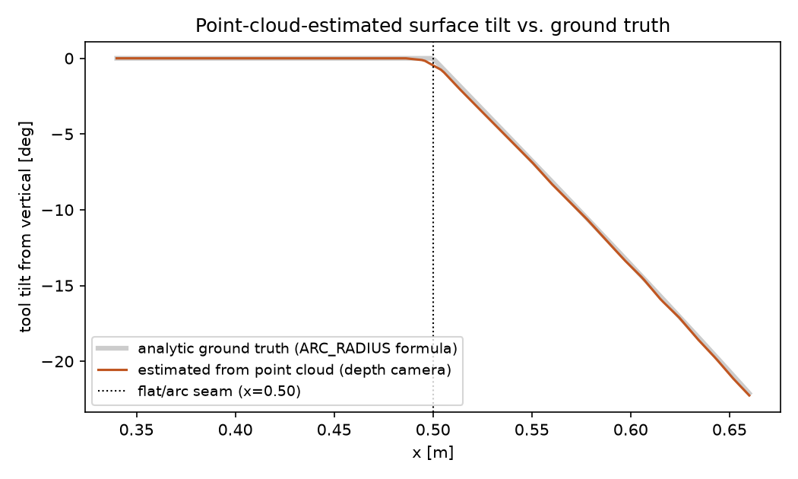

两条线几乎完全重合。在 $`x=0.65`$ 处，点云拟合出的倾角是 $`20.9^\circ`$，解析公式算出的真值是 $`\arcsin(0.15/0.425)\approx20.66^\circ`$——差距不到 $`0.3^\circ`$。这条验证很重要：它证明这套感知管线是**真的从渲染出来的深度图里独立算出了正确的几何形状**，不是“用另一种方式把作弊公式包装了一下”。

> **检查点**：为什么要在 `while True` 循环外面扫描一次，而不是每一步（甚至每一轮 GUI 循环）都重新扫描？（提示：想一想工件在打磨过程中会不会变形，以及重新渲染一次深度图、重新做 40 次 SVD 平面拟合的计算成本。）

> **常见误解**：法线是从点云"实时"拟合出来的，所以每一步都要重新渲染相机、重新做 SVD。——不是，感知（扫描 + 拟合）只做一次，实时的只是**查表**（`estimate_normal_at_x`，一次线性插值，非常便宜）。真正实时变化的是姿态**目标**，不是姿态**感知**过程本身——这个区分在真实机器人系统里也一样：先扫描建图，再在建好的图上实时规划/控制，通常不会每个控制周期都重新扫描一次。

### 11.6 同一法线怎样进入姿态、力控和运动控制

到这里，`local_normal` 的三个用途已经形成完整闭环：

| 用途 | 当前代码 | 对应章节 |
| --- | --- | --- |
| 姿态目标 | `desired_press_axis = -local_normal` | 10.5、11.4 |
| 力控制轴 | `f_n_raw = f_raw @ local_normal`、`F_normal = Fn_cmd * n` | 8.2、8.5、10.3、10.7 |
| 切平面运动 | `pos_err_tan`、`v_tan` 的投影 | 8.6、9.2、10.7 |

早期中间版本只让姿态跟随法线，力反馈仍读取世界 $`z`$ 分量，轨迹仍限制在世界 $`xy`$ 平面。它“看起来已经会贴合曲面”，但控制器只有三分之一真正使用了感知结果；第八章推导的 $`1/\cos\theta`$ 过压和切向力泄漏仍然存在。

当前版本在同一控制步只查询一次法线，并把这个结果传给三个消费者。这样避免姿态、力控制和运动投影对表面方向产生不一致理解。


### 11.7 感知的必要性验证：相机到底有没有用，没有相机行不行

前几节证明了"用法线做力控制和轨迹跟踪"比"用世界系"好，但这留下一个更根本的疑问：这个提升到底是**相机**带来的，还是**表面系分解**这个数学结构本身带来的（哪怕法线是从别处、甚至是作弊得到的）？如果答案是后者，那相机除了"看起来更真实"之外还有没有实际价值？这一节用三组对照实验回答这个问题。

**实验设计**：固定其他一切不变，只改变 `local_normal` 的来源，跑三种模式：

| 模式 | 法线来源 | 说明 |
|---|---|---|
| world | 固定 `(0,0,1)` | 完全不用法线，第八章一直在对比的旧世界系版本 |
| analytic | `ARC_RADIUS` 公式解出的精确解析法线 | "作弊"版本，只有仿真设计者才能这么干 |
| camera | 深度相机点云 + SVD 拟合 | 真实实现，`main()` 里实际跑的就是这个 |

三组统一用同一个解析真值做度量（`f_raw` 投影到真实法线上再滤波），这样比较的是"控制效果"而不是"评分标准不同"。结果：

```
    world: flat_err=0.206N  arc_err=0.486N  arc_mean_force=8.400N
 analytic: flat_err=0.220N  arc_err=0.251N  arc_mean_force=8.018N
   camera: flat_err=0.219N  arc_err=0.250N  arc_mean_force=8.001N
```

**analytic 和 camera 在圆弧区的误差只差 0.7%**，两者都比 world 好接近一倍。结论很干脆：**相机没有让数字变得“更好”，它让数字在不用作弊的前提下“一样好”**。表面系分解带来的提升（约 2 倍）来自于“有没有一个足够准的局部法线”这件事本身；相机的价值在于把“足够准的法线”从只有仿真设计者知道曲率公式才能做到，变成不知道先验几何也能做到，而且几乎不损失精度。这跟 11.5 节的精度验证（倾角误差不到 $`0.3^\circ`$）是同一个结论的两种证据。

**进一步的疑问**：如果没有相机，靠机械臂本来就要读的接触力传感器，能不能顺便把法线也测出来？打磨接触在低摩擦假设下，接触力方向应该大致沿着真实法线（第八章 8.5 节推导 $`1/\cos\theta`$ 偏差时用的正是这个假设）——那反过来，把测到的力向量归一化，是不是就能当法线用，完全不需要相机？

实测发现**这条路走不通**，而且是系统性地走不通，不是偶尔失灵：

```
     world: flat_err=0.206N  arc_err=0.486N  法线角度误差=9.84°
  analytic: flat_err=0.220N  arc_err=0.251N  法线角度误差=0.00°
    camera: flat_err=0.219N  arc_err=0.250N  法线角度误差=0.15°
 force_dir: flat_err=1.950N  arc_err=1.850N  法线角度误差=30.52°
```

`force_dir`（纯靠接触力方向估计法线，不用相机）不但没有比什么都不做的 `world` 好，反而差了好几倍——连**平面区域**（法线明明就是 $`(0,0,1)`$，理论上最简单）都恶化到 $`1.95\,\mathrm{N}`$。原因是工件摩擦系数并不小（仿真里 `friction="0.8 0.01 0.0001"`），打磨头一边压着 $`8\,\mathrm{N}`$ 法向力，一边沿光栅路径主动滑动，滑动摩擦力能达到 $`\mu F_n\approx0.8\times8=6.4\,\mathrm{N}`$，跟法向力几乎是同一量级。这股摩擦力跟着滑动方向变化，把接触力向量拽偏近 $`30^\circ`$，因此不能直接把合力方向当成法线。

> **常见误解**：接触力传感器已经有了，法线估计应该可以顺手用它免费得到，不需要额外的相机。——只在打磨头**静止不动**时成立；一旦真的开始"压着蹭"（这正是打磨任务的核心动作），摩擦力就不是可忽略的小量，纯靠力方向反推法线在这类任务里系统性地不可靠。

这样，"没有相机怎么办"这个问题就有了三条实际可行的路，按工业界常见程度排序：

1. **离线路径 + CAD 先验**（最常见）：如果工件形状和摆放位置事先知道（哪怕只是设计图纸而非在线感知），可以把整条路径和姿态离线算好、写成一系列位姿点（示教器/CAM 生成刀路）。本质就是"analytic 作弊版"，只是曲率来源从代码公式换成工程师从图纸量出来的路径点。代价是一旦实物和 CAD 有公差、或摆放位置有偏差，姿态就会跟着算错。
2. **视觉/点云感知**（本项目的路线）：不需要提前知道形状，现场测出来，代价是需要相机和标定，且存在噪声容忍上限（第十二章 12.1-12.2 节）。
3. **纯机械被动柔顺**（硬件方案）：打磨头和机械臂之间加柔性关节（比如 RCC），姿态跟随完全靠物理结构，控制器甚至不需要知道法线是什么，代价是没法再用软件自由调整力控制增益。

---

## 第十二章　感知鲁棒性与力安全状态机

### 12.1 MuJoCo 相机为什么要主动加入噪声

MuJoCo 深度渲染本身近乎无噪声。若直接使用，点云感知永远处于不现实的理想条件。当前代码给每帧深度加入标准差 $`2\,\mathrm{mm}`$ 的独立高斯噪声，并平均 4 帧：

$$
\sigma_{\mathrm{avg}}
=\frac{\sigma_{\mathrm{single}}}{\sqrt N}
=\frac{2\,\mathrm{mm}}{\sqrt4}
=1\,\mathrm{mm}.
$$

因为感知只在打磨前执行一次，平均 4 帧的计算代价远小于在每个控制步重新扫描。

### 12.2 SVD 法线为何会断崖式失效

每个 $`x`$ 分箱的总宽度为 24 mm。若点在窗口内近似均匀分布，其 $`x`$ 方向标准差约为：

$$
\sigma_x\approx\frac{24\,\mathrm{mm}}{\sqrt{12}}\approx6.9\,\mathrm{mm}.
$$

当深度噪声也接近 7 mm，SVD 看到的“法线方向厚度”和“窄窗口的 $`x`$ 方向厚度”变得同量级，最小奇异向量不再稳定代表真实法线。误差会从几度突然恶化到 $`50^\circ\text{--}90^\circ`$，而不是线性增加。

跨窗口中位数滤波在这里无效，因为临界点附近不是少数离群窗口，而是几乎所有窗口都出现系统性方向歧义。可行方法包括：多帧平均、降低传感器噪声、扩大拟合窗口或引入带先验的稳健估计；扩大窗口会牺牲曲率空间分辨率。

### 12.3 命令限幅为什么不是安全保证

`F_MAX = F_TARGET + 1 N` 把控制器请求的法向力限制在约 9 N。若直接设成 8 N，PI 环失去克服动态误差所需的少量余量，测试中波动反而增加。

但命令力和实际接触力之间还有机械臂动力学、滑台弹簧和碰撞，因此实际瞬态可能超过命令上限。`F_MAX` 是日常控制的软约束，不是安全证明。

### 12.4 双滤波与合力兜底

安全阈值为：

- 快滤波法向力 $`>10\,\mathrm{N}`$；
- 快滤波合力 $`>20\,\mathrm{N}`$；
- 超阈值持续 $`25\,\mathrm{ms}`$。

合力通道不依赖估计法线。如果错误法线与真实接触力几乎正交，投影 $`\mathbf f^\mathsf T\hat{\mathbf n}`$ 可能接近 0，但 $`\lVert\mathbf f\rVert`$ 不会因为坐标轴选错而消失。合力阈值又必须高于法向阈值，因为正常打磨存在切向摩擦。

### 12.5 为什么撤离后必须锁定

早期逻辑在接触力下降后自动恢复打磨。如果故障是持续性的，系统会形成：

```text
过力 → 撤离 → 力下降 → 自动压回 → 再次过力
```

当前版本在释放接触后进入故障保持，本轮不再恢复。少打磨可以重新加工，持续过压可能直接损坏工件，这两个错误方向并不对称。

### 12.6 结构碰撞是另一类故障

当前安全动作假设危险发生在砂盘—工件接触，并沿表面法线撤离。如果真正碰撞发生在 Link3、Link5、底座或相机架，沿 $`+\hat{\mathbf n}`$ 移动砂盘未必能解除碰撞，甚至可能因运动学耦合加重问题。

因此，结构碰撞不能简单复用法向撤离。更合理的后续设计包括：停止任务力、关节速度阻尼、回退到已验证安全的关节位形、区分瞬时擦碰和持续卡死，并把硬件急停放在软件状态机之外。

> **检查点**：安全阈值越低是否越安全？不一定。阈值过低或没有持续时间判断会把正常摩擦和数值尖峰当成故障，导致系统无法完成任务；安全参数必须和传感器、采样周期、机械极限及风险分析一起设计。

---
## 第五部分　调参、验证与迁移

## 第十三章　案例分析：从历史 Panda 调参到当前 RM65-B

> 本章 13.1-13.8 完整保留早期 Panda/6 行光栅的实验数据，用来教学“如何排查”；具体数值不是当前 RM65-B 参数。13.9 再说明哪些结论可以迁移。

这一章记录的是开发这个项目时真实发生的调试过程，比直接给出"正确答案"更有参考价值——因为你以后做类似调参工作时，大概率也会先走一遍错误的排查方向。

### 13.1 问题现象

把轨迹从"6 厘米小圆"换成"覆盖整个工件的光栅扫描"之后，第一次跑无头模式，力误差从原来稳定的 0.8 N 左右，一下跳到接近 2 N，力曲线里还夹杂着 20 到 25 N 的尖峰——目标力只有 8 N，相当于瞬时过冲 2 到 3 倍。

### 13.2 第一个假设（错）：换行瞬间目标位置跳变

最初怀疑光栅扫描每换一行，$`x`$ 目标坐标会有一次跳跃式改变（约 6.4 厘米），阻抗弹簧被要求瞬间去够新目标，可能产生冲击。加上第六章 6.3 节所示的 $`x`$ 平滑过渡后，力误差几乎没变化（从 1.968 N 只降到 1.947 N），说明这不是主因。

### 13.3 第二个假设（错）：掉头瞬间速度反向

接着怀疑每行扫到头、往回掉头的瞬间，y 方向目标速度瞬间从正变负，这个速度反转可能引起冲击。把 y 的运动换成 smoothstep，甚至试过更高阶的"两端速度和加速度都为零"的曲线（quintic smootherstep）。结果：force spike 依然存在，最大力仍在 20 N 以上。这个假设也被推翻了。

### 13.4 排查方法：系统性地扫参数，而不是靠猜

两次直觉判断都没找到根因之后，改用系统方法——固定其他变量，只改一个参数，观察指标怎么变：

| $`K_{p,\text{xy}}`$（N/m） | `RASTER_ROW_PERIOD`（s） | 最后3秒力误差（N） | 最大瞬时力（N） |
|---|---|---|---|
| 300（原始值） | 3.0（原始值） | 2.14 | 21.4 |
| 300 | 6.0 | 1.32 | 20.5 |
| 300 | 10.0 | 0.72 | 23.6 |
| 150 | 5.0 | 1.54 | 17.3 |
| **100** | **8.0** | **0.82** | **13.0** |
| 40 | 3.0 | 0.88 | 12.4（但轨迹跟踪严重失真，见本章 13.6 节） |

下图把这三组最有代表性的结果画成对比图，比表格更容易一眼看出规律：

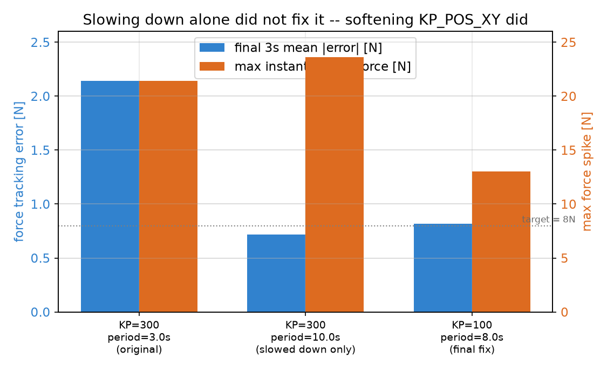

最关键的一组对比是前两根蓝橙柱——即使把 `RASTER_ROW_PERIOD` 从 3 秒放慢到 10 秒（速度慢了 3 倍以上），最大瞬时力（橙色）依然高达 23.6 N，几乎没有改善，力误差（蓝色）虽然降了但那只是"平均效应"。真正让两个指标同时大幅下降的，是第三组把 $`K_{p,\text{xy}}`$ 降到 100。

### 13.5 真正的根因：刚度和任务尺度不匹配

原因可以用第七章的公式直接解释：

$$
F = K_p \cdot (\text{位置误差})
$$

原来的 `KP_POS_XY=300` 是为一个 12 厘米直径的小圆调的，误差通常只有几毫米到 1 厘米量级；光栅扫描把范围扩大到 32 厘米见方，换行、换目标带来的瞬时误差量级也跟着扩大了好几倍。同样的刚度乘上更大的误差，算出的修正力自然成比例地更大。这个修正力再通过第十章 10.9 节的 $`J^\top`$ 映射到历史 Panda 的 7 个手臂关节力矩中；$`xy`$ 方向突然变大的修正力会经过耦合动力学，让本该主要由 $`z`$ 向力反馈决定的接触力也跟着抖动，这就是“侧向修正力漏进法向力控制环”。

### 13.6 修复：软化刚度，同时保证还能追得上

把 `KP_POS_XY` 直接降到 40 确实能让力误差和峰值都表现得很好，但代价是弹簧变得太软，实际跟踪出来的轨迹和光栅扫描设计的范围对不上——检查发现打磨头实际到达的 y 方向只到 0.130，远没有到设计的 $`\pm 0.16`$，轨迹压根没有覆盖到工件边缘，违背了"完整打磨整个平面"这个初衷。这提示一个重要的权衡：

- 刚度太高 → 追得很准，但修正力过大，污染力控制环。
- 刚度太低 → 修正力小、不污染力环，但追不上目标，覆盖不到设计范围。

最终选择 `KP_POS_XY=100`，同时把 `RASTER_ROW_PERIOD` 从 3 秒放慢到 8 秒——两者配合，既让侧向修正力小到不足以扰动力控制环，又给了阻抗弹簧足够的时间追上目标，实测覆盖范围回到接近设计值，力误差 0.82 N，最大瞬时力 13 N，是这次调参过程里综合表现最好的一组。

### 13.7 可以推广的一般结论

阻抗控制（以及更广义的 PD 控制）里的 $`K_p/K_d`$ 不是"调好一次就能用在所有场景"的通用常数，而是针对特定任务的空间尺度和运动速度手调出来的。任务的范围或速度发生数量级上的变化时，之前调好的增益很可能需要重新调整——这条经验同样适用于 robosuite `OSC_POSE` 里的 `kp`/`damping_ratio`：如果你把某个任务从"末端小范围微调"换成"大范围搬运"，同一组增益大概率也需要重新调。

### 13.8 第二次踩坑：力噪声的根源不是"要不要加 D 项"，而是滤波系数

第一次踩坑解决了力的**尖峰**问题，但即使调好 `KP_POS_XY` 之后，力曲线在 8N 附近还是有明显的"毛刺"——细看数值，稳态振荡的标准差有 1.06N，峰峰值接近 9.4N，比"最后 3 秒平均误差 0.82N"这个数字给人的印象抖得多（正负抖动会互相抵消，平均误差小不代表信号干净）。这次踩坑走了两条弯路，最后发现问题出在一个最不起眼的参数上。

**弯路一：给 z 轴力控制加一个经典 PID 的 D 项。** 直觉上"抑制振荡该加微分项"，实测结果却是 $`K_{d,f}`$ 从 0 加到 0.02，标准差反而从 0.305N 升到 0.352N——**越加越抖**。原因是 D 项本质是对信号求导数，而求导数在数学上等价于放大高频成分；力信号本身就带高频噪声（接触求解器的数值伪影），对着一个本来就吵的信号求导，噪声被放大得更凶。

**弯路二：给 z 轴加一个基于已知曲率的速度前馈**（提前算出"表面在这一刻应该以多快的速度升高，直接把这部分补偿加上去"）。实测同样没有帮助（标准差从 0.305N 变成 0.338N，反而略差）。原因跟这套光栅扫描的设计有关：一整行 8 秒的扫描里，工具沿 y 移动，而高度只跟 x 有关——也就是说 95% 的时间里根本没有跨越任何曲率，前馈没有可利用的信息；唯一会跨越曲率的换行时刻（仅占一行时间的 5%），额外测试发现即使把换行压缩到"几乎瞬间完成"，跨越真实曲率的换行也没有比纯平面换行更抖——说明这套已经调好的力反馈环路本身带宽就足够吃掉这种量级的扰动，前馈没有用武之地（只有故意构造一个不合理的"瞬间跳变 31mm"的极端场景，反馈才会真的顶不住，此时力从 1.4N 甩到 23N——这才是前馈真正该出场的场景）。

**真正的修复：把 `F_FILT_ALPHA` 从 0.1 调到 0.03**。效果立竿见影：标准差从 1.06 N 降到 0.30 N，峰峰值从 9.4 N 降到 2.6 N，最后 3 秒平均误差反而从 0.82 N 降到 0.25 N。

**为什么这么有效**：`f_filt` 更新式是一个指数滑动平均（EMA），数学上等价于一阶 RC 低通滤波器，截止频率近似为

$$
f_c \approx \frac{\alpha \cdot f_s}{2\pi}, \qquad f_s = 500\ \text{Hz}
$$

`α=0.1` 对应截止频率约 8Hz，`α=0.03` 对应约 2.4Hz——只放行 2.4Hz 以下的信号。这套光栅扫描每行要 8 秒，真正关心的信号（高度缓慢变化、力缓慢趋近目标）变化频率远低于 1Hz；而接触求解器的数值噪声集中在几赫兹到几百赫兹。**真信号和噪声天生"住"在频谱的两端，中间隔得很开**，随便在中间插一条分界线，就能几乎无损地把两者分开。用 FFT 把原始力信号和滤波后信号的频谱画出来对比，能直接看到这个分界（低频段两条线重合，几赫兹以上滤波后的线断崖式下降）。

> **常见误解**：仿真里能这么"轻松"地调好噪声，是不是说明这本来就不是个难问题？——不是，这是仿真的特殊之处替你屏蔽了大部分真实难度。真实力/力矩传感器装在手腕上，测到的力混杂着工具自身运动产生的惯性力，需要先做动力学解耦；真实系统里滤波会引入额外相位延迟，叠加通讯延迟可能把控制环推向不稳定；真实表面的粗糙度产生的力波动是有意义的真实信号，滤太狠会把有用信息也一起丢掉；真实系统调参出错的代价是损坏设备甚至伤人，不能像仿真这样几分钟内扫完六组参数。这次能"轻松"解决，是因为仿真里的噪声纯粹是数值离散化的伪影，跟真实物理无关，滤掉它不损失任何有意义的信息——这是仿真独有的便利，不代表真实力控制里的噪声抑制问题也这么简单。

---


### 13.9 当前 RM65-B 版本应怎样继承历史结论

历史案例中“降低刚度、放慢轨迹”解决的是特定 Panda、小范围或 6 行轨迹参数，不能直接把最终数值搬到当前 RM65-B。当前版本为了在 $`4.5\,\mathrm{s}`$ 内跟上 310 mm 扫程，将切向刚度重新调到 $`400\,\mathrm{N/m}`$，并增加 1 秒端点停留。

真正可迁移的是方法：

1. 先明确现象和评价指标；
2. 一次只改变一个假设；
3. 同时看力曲线和实际轨迹；
4. 区分目标轨迹问题、执行器跟踪问题、法线感知问题和接触求解问题；
5. 每次改变任务尺度、速度、机器人或末端后重新验证增益。

---

## 第十四章　系统验证、实机边界与下一步

### 14.1 验证不能只看一个平均误差

完整验收至少包含：

| 类别 | 指标 |
| --- | --- |
| 力跟踪 | 稳态平均误差、标准差、峰峰值、原始/快/慢峰值 |
| 轨迹 | 目标与实际 TCP 路径、每行端点到达程度 |
| 覆盖 | 砂盘 footprint 的全局和逐行范围 |
| 感知 | 法线角度误差、world/analytic/camera 对照、噪声压力测试 |
| 安全 | 正常运行不误触发、持续故障能触发、释放后锁定 |
| 碰撞 | 非预期接触对日志、持续时间和应急动作 |

平均误差可能掩盖正负波动；全局覆盖可能掩盖某一行未到边缘；慢滤波曲线可能掩盖危险的短期原始峰值。因此必须同时看多种统计量。

### 14.2 当前代表性结果

当前完整仿真最后 3 秒平均法向力误差约 $`0.151\,\mathrm{N}`$；原始、快滤波、慢滤波法向力峰值约 $`11.02/9.69/8.44\,\mathrm{N}`$。法向 $`10\,\mathrm{N}/25\,\mathrm{ms}`$ 和合力 $`20\,\mathrm{N}/25\,\mathrm{ms}`$ 条件未触发，正常配置下无结构碰撞报告。

### 14.3 与 robosuite 和 deoxys 的对应关系

| 当前项目 | robosuite OSC_POSE | deoxys Cartesian impedance |
| --- | --- | --- |
| 切平面位置误差与阻抗增益 | `position_error`, `kp`, `kd` | Cartesian stiffness/damping |
| $`J^\mathsf T\mathbf w`$ | `J_full.T @ decoupled_wrench` | Jacobian transpose mapping |
| `qfrc_bias` | torque compensation | gravity/Coriolis compensation |
| 法向 PI 力控 | 默认没有，需要扩展 | 取决于具体力控模式 |
| 点云局部法线 | 默认没有 | 通常由外部感知系统提供 |
| 安全锁定 | 仿真任务自行实现 | 实机还需控制柜和硬件安全层 |

共同核心是任务空间 wrench 到关节力矩的映射。本项目额外加入了局部表面系、显式力控、点云感知和安全状态机。

### 14.4 从仿真到实机仍缺什么

真实部署至少需要：

- 读取 Gemini 336L 的实际内参和深度尺度；
- 完成 RGB/Depth 对齐和 eye-to-hand 外参标定；
- 将真实 Y16 深度接入点云管线；
- 标定工件坐标系、机器人基座与相机坐标系；
- 根据真实气动工具铭牌和实验辨识替换滑台质量、刚度、阻尼、行程与气路动态；
- 使用真实力/力矩传感器或可靠的接触力估计；
- 将软件安全与 RM65-B 控制柜、气路泄压、限速区和硬件急停联动；
- 重新评估摩擦、砂盘磨损、材料去除率和热效应。

### 14.5 全书概念依赖图

```text
当前任务与硬件
    ↓
XML 物理模型 ─→ MuJoCo 状态、接触与动力学
    ↓
工件几何 + 13 道轨迹
    ↓
雅可比与任务空间阻抗
    ↓
法向显式力控 + 切平面运动
    ↑
深度图 → 点云 → 局部法线
    ↓
完整控制循环
    ↓
双滤波安全 + 合力兜底 + 故障锁定
    ↓
调参、覆盖、鲁棒性与实机边界验证
```

### 14.6 你现在应该能够

- 从 XML 找到每个关节、执行器、滑台和接触几何的物理含义；
- 解释为什么 TCP 速度要包含气动滑台，而关节力矩映射只使用 6 个手臂自由度；
- 从投影矩阵推导法向/切向混合控制；
- 逐段解释当前 `main()` 的数据流和状态转换；
- 判断一个力峰值来自控制、轨迹、感知、机械限位还是数值接触；
- 设计一组既能验证正常性能、又能验证故障保护的实验；
- 明确哪些结论来自仿真，哪些仍需实机标定和安全认证。

---
## 常见误解

| 误解 | 为什么容易这样想 | 正确的理解 |
|---|---|---|
| 阻抗控制的增益调好一次就能一直用 | 代码里 `KP_POS_XY` 看起来像个固定常数 | 增益是针对特定任务的空间尺度与速度调出的，任务范围、速度、机器人或工具改变后通常要重新验证（第十三章） |
| 法线方向显式力控制需要知道工件的精确高度 | 直觉上“控制”总是需要一个目标位置 | 显式力控制不需要法向位置目标，只需要接触力读数和控制方向（第八章） |
| 姿态跟着表面法线倾斜了，力控制和轨迹跟踪就自动"对"了 | 姿态是最直观能看到的变化，容易觉得"感知已经生效了" | 姿态、力控制、轨迹投影是三个独立读取 `local_normal` 的地方，只做姿态跟随而不把力和运动也投影到同一个法线/切平面上，会在倾斜表面留下 $`1/\cos\theta`$ 的系统性过压偏差（第八章 8.5 节、第十一章 11.6 节） |
| 换行/掉头的目标突变就是这次 force spike 的根因 | 这是最先想到、也最容易验证的假设 | 平滑处理过后 spike 几乎没变，真正根因是刚度和误差幅度不匹配（第十三章 13.2-13.5 节） |
| 平面和圆弧只要高度对上，看起来就是平滑的 | “对上”这个词听起来已经足够 | 高度对上只保证没有台阶，斜率（切线方向）也要对上才不会有折角（第五章） |
| `qfrc_bias` 只是可选的优化项 | 代码里只是简单地"加上去" | 没有它，控制器要把大部分力矩用来对抗重力，任务响应会明显变慢变差（第十章 10.9 节） |
| 力信号抖，加个 PID 的 D 项就能压下去 | D 项在很多教科书例子里确实能抑制振荡 | D 项是对信号求导，会放大高频噪声；力信号本身噪声集中在高频，加 D 项反而更抖（第十章 10.8 节） |
| 提前知道曲率，前馈总是能让控制更好 | "提前知道"听起来天然是优势 | 只有当曲率变化速度超过反馈环路本身能跟上的带宽时，前馈才有意义；本项目的反馈环路带宽本来就够用，前馈测出来没有帮助（第十章 10.8 节） |
| 点云拟合法线，需要每一步都重新扫描一次 | "实时跟随"听起来暗示"实时感知" | 感知（扫描+拟合）只做一次，实时的只是对已经建好的查表做插值；真正随时间变化的是姿态目标，不是感知过程本身（第十一章 11.5 节） |
| `F_MAX=9N` 就能保证实测力永远不超过 9N | 命令力和接触力都用 N 作单位，看起来像同一个量 | `F_MAX` 只限控制器命令；动力学和碰撞瞬态仍可让实测力越界，必须另设测量通道安全监控（第十二章 12.3-12.4 节） |
| 安全撤离后自动恢复更“智能” | 瞬时故障确实可能自行消失 | 持续性故障会导致反复撤离和压回；当前版本在释放接触后锁定，等待上层或人工复位（第十二章 12.5 节） |
| 点云噪声只会让法线逐渐变差 | 一般传感器误差常被想成连续退化 | 当噪声尺度接近拟合窗口的横向散布时，SVD 的最小方向发生歧义，会断崖式失效（第十二章 12.2 节） |
| 相机感知带来的提升，就是相机本身“看得准”带来的 | 相机是新加的硬件，容易把提升全部归功于它 | 提升的大头来自表面系分解这个数学结构；相机的价值是在不作弊的前提下提供足够准的法线（第十一章 11.7 节的 world/analytic/camera 对照） |
| 只要力安全机制做得够严，就能防住所有运行异常 | “安全”听起来应该是一个笼统的整体保证 | 力相关通道只能监控打磨接触力；机械臂连杆撞到工件或底座是另一种故障，当前只有日志、尚未接入跳闸逻辑（第十二章 12.6 节） |

---
## 习题

**1（回忆，基础）** MuJoCo 里 `MjModel` 和 `MjData` 分别存什么？请各举一个具体例子。

**2（概念，基础）** 为什么阶段 2 的 z 轴代码里，找不到任何一个变量代表"z 应该在哪"？

**3（应用，基础）** 如果 `KP_POS_XY = 64`，阻尼比 $`\zeta=1`$（临界阻尼），$`K_d`$ 应该是多少？

**4（应用，中等）** 沿用上一题的增益，某一时刻 y 方向位置误差是 0.03 m，末端 y 方向速度是 -0.05 m/s（正在远离目标反向运动），求此刻的 $`F_y`$。

**5（迁移，中等）** 如果要把工件曲面设计成"先平、再一段圆弧往下凹"（一个凹槽而不是往上凸的坡），第八章的公式要怎么改？（提示：现在这版公式里圆心在曲面**上方**，交界点是那个圆的**最低点**；凹槽版本呢？）

**6（错误诊断，挑战）** 假设有人在阶段 2 的 z 轴里写了这样的代码：

```python
Fz_cmd = -(F_TARGET + KP_F * f_err + KI_F * f_integral) - BZ * x_dot[2] \
         + KP_POS_Z_APPROACH * (Z_SURFACE_GUESS - x_cur[2])
```

这段代码有什么问题？会导致什么现象？

**7（综合，挑战）** 结合第九、十章，解释：如果把 `RASTER_ROWS` 从 6 改成 20（更密的扫描），在不改动任何增益的前提下，你预期力误差和最大瞬时力会怎么变化？为什么？（提示：更密的扫描意味着换行更频繁，但每次换行的 x 步长变小了。）

**8（概念，中等）** `build_orientation_from_normal()` 在法线是 $`(0,0,1)`$ 时，算出来的姿态跟原来写死的 `R_down` 精确相等。这个性质为什么重要？如果不满足会怎样？

**9（应用，挑战）** 如果把 `scan_cam` 的高度从 `z=1.0` 降到 `z=0.5`，同时保持默认 $`45^\circ`$ 视场角不变，会发生什么问题？（提示：算一下这个高度下相机能看到的半宽，跟工件半宽 $`0.18\,\mathrm{m}`$ 比一比。）

**10（应用，挑战）** 假设打磨头正处在圆弧区域某一点，局部法线倾角 $`\theta=25^\circ`$。如果控制器仍然用“只控制世界 $`z`$ 分量”的旧写法（`f_raw[2]` 而不是 `f_raw @ local_normal`），并且已经把这个 $`z`$ 分量稳定调节到了目标值 8.0 N，问：此刻真实的法向力（沿 $`\hat n`$ 方向）大约是多少？跟目标值比，过压了百分之几？

**11（概念，中等）** `pos_err_tan = pos_err - (pos_err @ n) * n` 这一行，如果偷懒写成"直接把 `pos_err` 的 z 分量设成 0"（也就是继续只用世界 xy 分量做阻抗），在纯平面区域和在圆弧区域分别会不会出问题？为什么两种情况的答案不一样？

**12（安全，应用）** 原始接触力在一个时间步冲到 11 N，但快滤波力的峰值只有 9.7 N，随后立即回落。当前安全状态机是否应该跳闸？为什么？

**13（感知，应用）** 单帧深度噪声标准差为 6 mm。若希望通过独立多帧平均把等效标准差降到不超过 2 mm，至少需要平均多少帧？

**14（错误诊断，挑战）** 某人删除合力安全通道，只保留 `f_raw @ local_normal` 的法向阈值。他认为“我们只关心法向力”。请构造一种点云法线错误会让这一安全判断漏报的情况。

**15（概念，中等）** 11.7 节的三组对照实验里，`analytic`（用 `ARC_RADIUS` 公式算出的解析法线）和 `camera`（点云拟合）在圆弧区的误差只差 0.7%。如果这个差距变成了 30%（也就是相机版本明显更差），这说明问题出在哪一层——是“表面系分解”这个数学结构本身，还是感知管线？为什么？

**16（安全，挑战）** 12.6 节指出机械臂连杆可能撞到工件或底座，但当前安全状态机不会因此触发。如果要把结构碰撞也接入 `safety_tripped`，除了“检测到就立即跳闸”之外，还需要考虑什么？（提示：12.5 节的撤离逻辑要求打磨头沿 `+n` 离开表面；如果碰撞发生在其他连杆上，这个方向还有意义吗？）

### 参考答案

1. `MjModel` 存静态的、编译自 XML 的内容（比如"关节 5-7 的力矩上限是 12 Nm"）；`MjData` 存运行时不断变化的状态（比如"此刻 joint3 的角度是 0.42 rad"）。

2. 因为 z 轴用的是显式力控制，不是位置控制——它的反馈量是接触力读数 `f_filt`，不是位置误差，所以没有"目标位置"这个概念，只有"目标力" `F_TARGET`。

3. $`K_d = 2\sqrt{64} \times 1 = 16`$。

4. $`F_y = 64 \times 0.03 - 16 \times (-0.05) = 1.92 + 0.8 = 2.72`$ N（注意速度是负数，减去负数等于加上去，阻尼项和弹簧项这次同方向叠加，因为末端正在"背离"目标运动，阻尼在帮着往回拉）。

5. 现在这版 $`h(s)=R-\sqrt{R^2-s^2}`$ 里，圆心在曲面**上方** $`R`$ 处，交界点是圆的**最低点**。要做成凹槽，需要把圆心换到曲面**下方** $`R`$ 处，让交界点变成圆的**最高点**：$`h(s)=\sqrt{R^2-s^2}-R`$。这样 $`s=0`$ 处仍有 $`h(0)=0`$ 且斜率为 0，但往两边走时 $`h(s)<0`$，形成凹槽。

6. 这是第八章 8.4 节警告过的错误——在 z 轴上同时保留了力控制项和一个额外的位置刚度项 `KP_POS_Z_APPROACH * (Z_SURFACE_GUESS - x_cur[2])`。两者会互相打架：位置项说"往 Z_SURFACE_GUESS 那个高度去"，力控制项说"往能维持目标力的高度去"，两者通常不是同一个高度，会导致接触力剧烈震荡（项目 README 里描述的 -70N 到 0N 跳变）。

7. 预期力误差和最大瞬时力都会**下降**（变得更稳定）。原因：`RASTER_ROWS` 变多、总扫描范围不变的情况下，相邻两行之间的 x 步长会变小（$`(0.66-0.34)/19`$ 远小于 $`(0.66-0.34)/5`$），根据第十三章历史调参案例的结论，换行时的位置误差幅度直接决定了侧向修正力的大小，误差幅度变小，修正力也变小，污染到 z 轴力控制环的程度自然减轻。

8. 这个性质保证了**新功能不会破坏旧行为**——工件的平面区域（法线始终是 $`(0,0,1)`$）在改造前后姿态控制完全一样，只有圆弧区域才会表现出新的倾斜行为。如果不满足这个性质，哪怕只是平面区域也会莫名其妙地引入姿态偏差，之前第五、六章验证过的所有平面区域行为都要重新验证一遍，而且很难说清楚"变化是感知误差还是设计问题"。

9. 相机在高度 $`h`$ 处、半视场角 $`22.5^\circ`$ 时，能看到的地面半宽是 $`h\tan(22.5^\circ)`$。原来 $`h=0.7\,\mathrm{m}`$ 时半宽约 $`0.29\,\mathrm{m}`$，比工件半宽 $`0.18\,\mathrm{m}`$ 富余不少；如果 $`h=0.2\,\mathrm{m}`$，半宽只有 $`0.2\times0.414\approx0.083\,\mathrm{m}`$，相机会看不全工件。边缘分箱会因拿不到点而退化为复用 `last_good`，法线估计随之变差。

10. 第八章 8.5 节推导过：$`f_{z,\text{raw}}=f_n\cos\theta`$。旧写法把 $`f_{z,\text{raw}}`$ 调节到 8.0 N，意味着 $`f_n=8.0/\cos(25^\circ)\approx8.83\,\mathrm{N}`$。过压比例是 $`(8.83-8.0)/8.0\approx10.3\%`$——比正文里圆弧区域实测的平均过压更大，因为这里假设的 $`25^\circ`$ 更陡。

11. 纯平面区域**不会**出问题：那里 $`\hat n=(0,0,1)`$，“把 $`z`$ 分量设成 0”和“减去沿 $`\hat n`$ 的投影”是同一个操作。圆弧区域**会**出问题：那里 $`\hat n`$ 有非零的 $`x`$ 分量，`pos_err` 沿 $`\hat n`$ 的部分不再等于纯 $`z`$ 分量。清零 $`z`$ 后仍会留下法向残余，切平面阻抗因而重新产生法向力分量。

12. 不应跳闸。当前判据监控独立快滤波信号，并要求超过 10 N 持续 25 ms；一个时间步的原始数值尖峰既没有让快滤波量越阈值，也没有满足持续时间。若原始尖峰变成持续碰撞，快滤波量会升高并触发保护。

13. 由 $`\sigma_{\mathrm{avg}}=\sigma/\sqrt{N}\le2\,\mathrm{mm}`$ 得 $`6/\sqrt{N}\le2`$，所以 $`N\ge9`$。至少平均 9 帧。

14. 假设真实接触力为 $`\mathbf f=(0,0,18)\,\mathrm{N}`$，但错误法线几乎指向 $`x`$ 轴，例如 $`\hat{\mathbf n}=(1,0,0)`$。投影得到 $`\mathbf f\cdot\hat{\mathbf n}=0`$，法向通道会误以为没有危险；但合力仍是 $`\lVert\mathbf f\rVert=18\,\mathrm{N}`$。若实际合力超过合力阈值并持续足够久，独立合力通道仍能跳闸。关键是投影可因错误坐标轴接近零，而模长不会。

15. 说明问题出在**感知管线**，不在表面系分解本身。`analytic` 用的是精确解析法线，代表"表面系分解在有完美法线时能做到多好"这个上限；`camera` 只是获取法线的另一种途径。两者用的是同一套分解公式（同一份 第十章 10.3-10.7 节代码），如果 `analytic` 表现很好而 `camera` 明显更差，唯一的差异来源就是点云拟合出的法线本身不够准——该去查 11.2/11.3 节的重建或拟合环节（比如深度噪声、ROI 裁剪、`SCAN_BIN_HALF_WIDTH` 选得合不合适），而不是去怀疑第九、十章的控制律写错了。

16. 至少要考虑两个问题。第一，碰撞可能发生在打磨头以外的任意连杆上，而 12.5 节的撤离动作是“打磨头沿 `+n` 离开工件表面”；若碰撞点在其他连杆上，这个动作未必能解除碰撞，甚至可能因运动学耦合让情况更糟。结构碰撞需要不同的应急动作，例如停止任务力、增加关节阻尼或退回已验证的安全关节位形。第二，还要决定是否加入类似 25 ms 的持续时间过滤，以区分一两个物理步的擦碰和真正持续卡死。

---
## 项目：把打磨路径换成"擦黑板"的之字形轨迹

**场景**：陈老师希望你验证这套"任务空间阻抗 + 显式力控混合"的结构是不是真的具备可迁移性——能不能不碰任何力控制代码，就把打磨任务换成一个完全不同形状的轨迹任务。

**目标**：在不修改 `Fn_cmd`/`F_normal` 法线方向力控制逻辑的前提下，把 `raster_xy()` 改造成一个更贴近"擦黑板"直觉的轨迹——x 方向慢速持续推进（模拟手臂整体从左到右移动擦黑板），y 方向快速小幅往返（模拟手腕来回摆动擦拭）。因为 `raster_xy()` 只负责生成切平面内的目标坐标，之后自然会被第十章 10.7 节的 `pos_err_tan`/`v_tan` 投影逻辑接住，所以换轨迹形状不需要碰任何法线/力控制代码。

**交付物**：

1. 修改后的 `raster_xy()` 函数（或新写一个 `wipe_xy()` 并在阶段 2 里换掉调用）。
2. 一次无头模式运行产出的 `polish_result.png`。
3. 一段简短的书面说明（3-5 句话），回答："你改了哪些行？为什么力控制部分完全不用动？"

**里程碑**：

- 第一步：先只改轨迹生成函数，跑一次无头模式，确认没有报错，看一眼轨迹图形状对不对。
- 第二步：调整 x 推进速度和 y 摆动频率/幅度，让轨迹图看起来真的像"擦黑板"而不是"光栅扫描"。
- 第三步：检查力误差是否还稳定在 1 N 以内——如果变差了，参照第十三章的方法排查是不是增益和新轨迹的速度/范围不匹配。

**约束**：

- 不能修改 `fill_workpiece_hfield()` 或工件几何。
- 不能修改 `F_task`、`tau_task` 和关节力矩限幅逻辑。
- 轨迹与砂盘 footprint 必须覆盖工件，同时不得进入机器人不可达或碰撞区域。

**评价标准**：

| 等级 | 标准 |
|---|---|
| 及格 | 轨迹能跑完不报错，力误差在 2 N 以内 |
| 良好 | 轨迹形状明显是"慢速推进+快速摆动"而不是网格状的光栅扫描，力误差在 1 N 以内 |
| 优秀 | 额外验证了在你选择的推进速度/摆动频率下，是否需要重新调整 `KP_POS_XY`（仿照第十三章的排查方法，做一次简单的参数对比） |

**可选拓展**：给这个"擦黑板"任务也设计一次故意制造 force spike 的实验（比如把摆动频率调得很高），然后自己应用第十章学到的排查方法定位并修复它。
## 附录

## 附录 A　Python 与 NumPy 语法速查

本附录保留原教材的完整语法讲解。建议在正文遇到对应写法时查阅，不必在开始学习控制系统之前一次性背完。
### A.1 Python / NumPy 语法基础

##### 2.0.1 列表推导式 `[... for x in ...]`

```python
arm_dof_idx = [model.joint(name).dofadr[0] for name in ARM_JOINT_NAMES]
```

这是"一行版 for 循环"，等价于：

```python
arm_dof_idx = []
for name in ARM_JOINT_NAMES:
    arm_dof_idx.append(model.joint(name).dofadr[0])
```

方括号 `[...]` 表示"把 for 循环每一轮算出来的值收集成一个列表"。试一试：

```python
>>> [x * 10 for x in [1, 2, 3]]
[10, 20, 30]
```

##### 2.0.2 f-string 字符串拼接 `f"actuator{i}"`

```python
arm_act_idx = [model.actuator(f"actuator{i}").id for i in range(1, 8)]
```

`f"..."` 里 `{}` 包住的表达式会被替换成它的值：

```python
>>> i = 3
>>> f"actuator{i}"
'actuator3'
>>> list(range(1, 8))     # range(1,8) 是 1 到 7，不包含 8
[1, 2, 3, 4, 5, 6, 7]
```

##### 2.0.3 NumPy 数组切片 `a[:3]`、`a[3:]`、`a[:, cols]`

这是全书用得最多的语法，值得多花两分钟。

```python
>>> import numpy as np
>>> a = np.array([10, 11, 12, 13, 14, 15])
>>> a[:3]        # 前 3 个（下标 0,1,2）
array([10, 11, 12])
>>> a[3:]        # 从下标 3 到最后
array([13, 14, 15])
```

代码里的对应（第五章会再遇到）：

```python
x_dot, omega = vel6[:3], vel6[3:]
# vel6 是 6 个数：[vx, vy, vz, wx, wy, wz]
# 前 3 个是线速度 -> x_dot，后 3 个是角速度 -> omega
```

这里同时用了**多重赋值**：`a, b = 值1, 值2` 是同时给两个变量赋值，不需要写两行。

二维数组的切片有两个位置，逗号前是行、逗号后是列：

```python
>>> m = np.array([[1, 2, 3, 4], [5, 6, 7, 8]])
>>> m[:, [0, 2]]      # ":" = 所有行，[0,2] = 只挑第 0、2 列
array([[1, 3], [5, 7]])
```

对应代码：`jacp[:, arm_dof_idx]`——`jacp` 是 3 行 × 9 列（7 个手臂关节 + 2 个手指关节），`[:, arm_dof_idx]` 表示"所有行都要，但只挑出手臂那 7 列，扔掉手指的 2 列"，结果变成 3×7。

##### 2.0.4 `np.vstack` —— 竖着摞起来

```python
>>> A = np.array([[1, 2], [3, 4]]); B = np.array([[5, 6], [7, 8]])
>>> np.vstack([A, B])
array([[1, 2], [3, 4], [5, 6], [7, 8]])
```

v = vertical（竖直）。把两个矩阵上下叠成一个更高的矩阵。

##### 2.0.5 `@` —— 矩阵乘法（不是 `*`）

```python
>>> M = np.array([[1, 0], [0, 2]]); v = np.array([3, 4])
>>> M @ v
array([3, 8])
```

`@` 专门表示矩阵乘法。`*` 在 NumPy 里是**逐个元素相乘**，是完全不同的运算，千万别混用。

`.T` 是**转置**——行列互换：

```python
>>> m = np.array([[1, 2, 3], [4, 5, 6]])
>>> m.T
array([[1, 4], [2, 5], [3, 6]])
```

##### 2.0.6 `.copy()` 和"视图"（view）

```python
x_cur = data.site_xpos[tcp_site_id].copy()
```

`data.site_xpos[...]` 拿到的不是独立数据，而是**直接指向 MuJoCo 内部内存的窗口**（术语叫"视图"）。下一次 `mj_step()` 一跑，MuJoCo 更新内部数据，你手里这个"窗口"里的数字也会跟着变。`.copy()` 是拍一张快照存下来，之后爱怎么变都不影响它。

```python
>>> a = np.array([1, 2, 3])
>>> b = a           # b 和 a 是同一份数据
>>> b[0] = 99
>>> a
array([99, 2, 3])   # a 也被改了！
>>> c = a.copy()    # c 是独立快照
>>> c[0] = 0
>>> a
array([99, 2, 3])   # a 不受影响
```

##### 2.0.7 `.reshape()` —— 重新排列形状

```python
R_cur = data.site_xmat[tcp_site_id].reshape(3, 3).copy()
```

MuJoCo 把旋转矩阵存成拉平的 9 个数，`.reshape(3, 3)` 把它重新叠回 3×3：

```python
>>> np.arange(9).reshape(3, 3)
array([[0, 1, 2], [3, 4, 5], [6, 7, 8]])
```

##### 2.0.8 `np.clip` —— 把数值夹在上下限之间

```python
>>> np.clip(150, -87, 87)     # 超过上限 -> 压到 87
87
>>> np.clip(-100, -87, 87)    # 低于下限 -> 抬到 -87
-87
>>> np.clip(50, -87, 87)      # 在范围内 -> 原样
50
```

`np.clip` 也能一次性作用在整个数组上（不只是单个数字），第八章会看到这个用法。

##### 2.0.9 `enumerate` + 多重赋值解包

```python
for k, aidx in enumerate(arm_act_idx):
    lo, hi = model.actuator_ctrlrange[aidx]
```

`enumerate` 在遍历时同时给你"第几个"和"内容"：

```python
>>> for k, val in enumerate(["a", "b", "c"]):
...     print(k, val)
0 a
1 b
2 c
```

`lo, hi = 一个装两个数的数组` 是把数组"拆开"分别赋给两个变量。

##### 2.0.10 `np.linspace` —— 生成等间距的一串数字

```python
>>> np.linspace(0, 1, 5)   # 从 0 到 1（包含两端），均匀取 5 个点
array([0.  , 0.25, 0.5 , 0.75, 1.  ])
```

第八、十二章会用它在工件宽度范围内均匀取样。

##### 2.0.11 `//` 整除 和 `%` 取模

```python
>>> 17 // 5    # 整除：17 除以 5 商几（向下取整）
3
>>> 17 % 5     # 取模：17 除以 5 余几
2
>>> 4 % 2      # 常用来判断奇偶：余 0 是偶数
0
```

第九章的 `raster_xy()` 用 `//` 算"现在是第几行"，用 `%` 判断"这一行是奇数行还是偶数行"（决定往哪个方向扫）。

##### 2.0.12 布尔掩码（boolean mask）筛选数组

```python
>>> a = np.array([10, 20, 30, 40])
>>> mask = a > 15          # 得到 [False, True, True, True]
>>> a[mask]                # 只留下 mask 为 True 的位置
array([20, 30, 40])
```

这是 NumPy 里最常见的"筛选符合条件的元素"写法，第十二章的点云处理会大量用到——比如"只保留距离小于某个值的点"。

##### 2.0.13 条件表达式（三元表达式）`a if 条件 else b`

```python
>>> x = 5
>>> "偶数" if x % 2 == 0 else "奇数"
'奇数'
```

这是 `if/else` 的单行写法，读作"如果条件成立就取 a，否则取 b"。第十二章 `estimate_normal_at_x()` 里会用到。

##### 2.0.14 `np.linalg.svd`、`np.cross`、`np.column_stack`、`np.interp`（先混个眼熟）

这四个函数专门在第十二章用到，这里先简单预告，用到时再详细展开：
- `np.linalg.svd(点集)`——奇异值分解，本书里专门用来"从一堆三维点里拟合出一个平面"。
- `np.cross(a, b)`——向量叉乘，算出同时垂直于 a 和 b 的第三个方向，专门用来搭建三维坐标系。
- `np.column_stack([a, b, c])`——把三个列向量横着拼成一个矩阵（各自变成一列）。
- `np.interp(x, 已知x数组, 已知y数组)`——线性插值，给一个新的 x，在已知的数据点之间"猜"一个合理的 y。

##### 2.0.15 `model.xxx("名字").id` —— 按名字查编号

```python
tcp_site_id = model.site("tcp_site").id
```

MuJoCo 内部所有东西（关节、几何体、相机、site……）都是按数字编号存的（这样访问数组更快），但数字编号不好记。`model.site("tcp_site")` 先按名字把这个 site 对象找出来，`.id` 再取出它的数字编号，后面就可以用这个编号去各种数组里查数据（比如 `data.site_xpos[tcp_site_id]`）。`model.camera(...)`、`model.geom(...)`、`model.actuator(...)`、`model.hfield(...)` 都是同一套用法。

##### 2.0.16 `np.meshgrid` —— 生成一整张网格的坐标

```python
>>> us, vs = np.meshgrid(np.arange(3), np.arange(2))
>>> us
array([[0, 1, 2], [0, 1, 2]])
>>> vs
array([[0, 0, 0], [1, 1, 1]])
```

给定"横向有几个点"和"纵向有几个点"，`np.meshgrid` 一次性生成两张形状相同的表格：一张记录每个位置的横坐标，一张记录每个位置的纵坐标。第十二章用它给深度图像的**每一个像素**同时生成"这是第几列、第几行"的坐标，避免写两层 for 循环。

##### 2.0.17 `.flatten()` / `.reshape(-1, 3)` —— 把多维数组拉平/改形状

```python
>>> m = np.array([[1, 2], [3, 4]])
>>> m.flatten()
array([1, 2, 3, 4])
```

`.flatten()` 把任意形状的数组拉成一条一维数组。`.reshape(-1, 3)` 是"改形状"的另一种写法，`-1` 表示"这一维的大小你（NumPy）帮我自动算，我只关心每一行有 3 个数"——常用来把"每个像素一个 (x,y,z) 三元组"的图像数据，整理成"每一行是一个三维点"的点云表格。

##### 2.0.18 `np.tile` —— 重复平铺一个数组

```python
>>> np.tile(np.array([1, 2, 3]), (2, 1))
array([[1, 2, 3], [1, 2, 3]])
```

把一维数组 `[1,2,3]` 当成一"行"，往下复制 2 份，拼成 2×3 的矩阵。第八章用它把"沿 x 方向算好的一条高度曲线"，直接复制成 hfield 需要的每一行都一样的网格数据（因为设计上高度沿 y 方向不变）。
## 附录 B　macOS、mjpython、GUI 与固定视角
### B.1 macOS 上的 mjpython 怪癖

如果要在 macOS 上弹出 MuJoCo 的交互式 3D 窗口（`--view` 参数），不能直接用普通 `python`，必须换成 `mjpython`。原因是 macOS 的 Cocoa 图形框架要求 GUI 事件循环跑在主线程上；`mjpython` 是一个特殊跳板程序，把主线程让给 GUI。路径空格的具体处理见下一节。

---

### B.2 GUI 视图与相机

#### B.2.1 mjpython 与路径空格的坑

B.1 节提到 macOS 上弹窗口必须用 `mjpython`。这个 `mjpython` 本质上是一个 Python 脚本，文件第一行是 shebang：`#!/路径/到/python`。如果路径本身包含空格（本项目目录 “Robot Manipulation/Force Control” 就带空格），Unix/macOS 内核解析 shebang 时会在第一个空格处切断路径。解决办法是显式用 Python 解释器运行 `mjpython`：

```bash
".viewer_venv/bin/python3.13" ".viewer_venv/bin/mjpython" polish_impedance_control.py --view
```

这样就不走 shebang 那一行了。另外本项目的 GUI 环境用独立的 `.viewer_venv`（基于 Homebrew 的标准 Python），而不是项目主 `.venv`——因为主 `.venv` 底层的 Python 发行版和 `mjpython` 的动态库加载机制存在路径解析上的兼容性问题，换成标准 Homebrew Python build 就没有这个问题。

#### B.2.2 targetbody 相机模式

```xml
<camera name="pad_view" mode="targetbody" target="hand" pos="0.85 -0.6 0.62"/>
```

这个模式下，相机的"位置"是世界坐标系下的固定点，只有"朝向"每一帧由 MuJoCo 自动重新计算，永远对准 `target` 指定的 body。跟另一种常见做法——直接把相机做成 `hand` body 的子节点——相比，子节点方案里相机会跟着 `hand` 一起平移和旋转，视角会随手腕摆动而摇晃；`targetbody` 模式则像一个稳定的旁观镜头，只是视线一直跟着目标转。第 313-322 行的 Python 代码负责在打开 `--view` 时把这个相机设为默认视角，窗口里按 `Tab` 键可以随时切回自由视角。

#### B.2.3 GUI 模式的自动循环

`main()` 用一个 `while True` 循环包住了整个仿真流程（第 330-429 行）：无头模式只跑一轮就退出；GUI 模式则会在每跑完一轮后自动重置状态、重新开始，一直循环播放，直到你自己手动关掉窗口（`viewer_ctx.is_running()` 检测到窗口已关闭）才会停止。注意这个"扫描一次点云"的动作（第十二章）是在 `while True` **外面**做的（第 302-306 行），只扫一次——真实系统里工件在打磨过程中不会凭空变形，没必要每次循环重新扫描。

---
## 附录 C　Franka Panda 历史原型

本附录完整保留早期 Panda 物理模型说明。它用于理解“直接力矩执行器 + TCP + 接触代理”如何从教学原型发展而来，不代表当前 `polish_scene.xml` 仍在使用 Panda。
### C.1 `panda_torque.xml`：改造过的 Franka Panda

基于 MuJoCo 官方 `mujoco_menagerie` 仓库里的 Franka Panda 模型改造而来。有三处关键改动。

**改动一：执行器换成直接力矩（第 274-280 行）。**

```xml
<motor name="actuator1" joint="joint1" ctrlrange="-87 87"/>
<motor name="actuator2" joint="joint2" ctrlrange="-87 87"/>
...
<motor name="actuator5" joint="joint5" ctrlrange="-12 12"/>
```

逐个属性看：`<motor>` 是"直接力矩执行器"标签——你往 `data.ctrl` 里写什么数字，它就原样当成力矩施加到关节上，中间不做任何转换。`name="actuator1"` 是这个执行器的名字（第五章 `model.actuator("actuator1").id` 就靠它查编号）；`joint="joint1"` 说明它驱动哪个关节；`ctrlrange="-87 87"` 是允许的力矩范围（牛顿·米），关节 1-4 是 $`\pm 87`$、关节 5-7 是 $`\pm 12`$，来自 Franka 官方数据手册里各关节电机的真实力矩上限（第五章 5.7 节做力矩限幅时读的就是这个）。

为什么要换？官方原版 `panda.xml` 里关节用的是内置的**位置伺服**（position servo）执行器——你给一个目标角度，MuJoCo 内部的 PD 控制器自动帮你转过去。这对本项目完全不适用：我们要自己实现任务空间的阻抗/力控制律，需要对每个关节有直接的力矩控制权，中间不能再插一层看不见的 PD 控制器抢方向盘。

**改动二：加了 TCP 坐标系和打磨头（第 219-222 行）。**

```xml
<site name="tcp_site" pos="0 0 0.1" size="0.006" rgba="1 0 0 1"/>
<geom name="pad_geom" type="sphere" pos="0 0 0.1" size="0.015"
      rgba="0.9 0.5 0.1 1" contype="2" conaffinity="2"
      friction="0.8 0.01 0.0001" solref="0.01 1" solimp="0.9 0.95 0.001"/>
```

`<site>` 是一个"参考点"（不参与碰撞、没有质量，纯粹是个坐标标记）：`name="tcp_site"` 是 Tool Center Point，代码里所有"末端位置/姿态"都从这里读（`data.site_xpos[tcp_site_id]`）；`pos="0 0 0.1"` 是它相对 hand 的位置（沿手的 z 轴往外 0.1 米）；`size`/`rgba` 只影响在 viewer 里画出来的红点大小和颜色，不影响物理。

`<geom name="pad_geom">` 是真正跟工件接触的打磨头：`type="sphere"` 球形、`size="0.015"` 半径 1.5 厘米、`rgba="0.9 0.5 0.1 1"` 橙色。后面几个属性关系到接触物理——`contype="2" conaffinity="2"` 是"碰撞分组掩码"，决定这个几何体能跟谁碰撞（工件也设成 2，两者才会互相接触，而机械臂其它连杆是默认组，不会误撞工件）；`friction="0.8 0.01 0.0001"` 是摩擦系数（滑动/自旋/滚动）；`solref`/`solimp` 是 MuJoCo 接触求解器的"软硬"参数（接触面像多硬的弹簧、多快收敛），这里用的是偏硬的设置，让接触力响应更快。这些接触参数你现在不需要深究，知道"它们控制接触有多硬、摩擦有多大"即可。

**改动三：定义了初始姿势（第 286-288 行）。**

```xml
<keyframe>
  <key name="home" qpos="0 0 0 -1.57079 0 1.57079 -0.7853 0.04 0.04" ctrl="..."/>
</keyframe>
```

`<keyframe>` 存了一个叫 `home` 的初始状态，`qpos` 是 9 个关节的初始角度（7 个手臂关节 + 2 个手指）。第五章 `main()` 每轮开始时的 `mujoco.mj_resetDataKeyframe(model, data, key_id)` 就是把机械臂"摆回"这个姿势——这样每次仿真都从同一个已知的、手臂悬在工件上方的姿态开始。
## 附录 D　历史版逐文件、控制循环与 6 行轨迹精读

下面保留旧教材的逐行讲解和 6 行光栅参数，作为开发演化记录。阅读时请注意：其中 7 个手臂关节、2 个手指关节、`pad_view`、6 行光栅和旧代码行号均属于历史版本；当前实现以正文第三、六、十章为准。
### D.1 历史版系统架构：三层结构

"大地图"那张图给了整体骨架，这一章把三层各自负责什么、层与层之间**到底传递哪些具体数据**讲清楚——因为后面第四、五章会一行一行读这些数据是怎么被读出来、算出来、写回去的，先建立"数据在三层之间怎么流动"的心理模型会省很多力气。

#### D.1.1 三层各自负责什么

**最上层：XML 模型文件（静态定义）。** 当前版本由 `rm65b_pneumatic.xml` 定义 RM65-B 的 6 个旋转关节、直接力矩执行器、气动滑台、柔性背衬砂盘、`tcp_site` 和 `pad_geom`；`polish_scene.xml` 引用它并加入工件、工作台、固定式 Gemini 336L 等效相机和观察机位。这一层不涉及任何任务控制逻辑，启动时被编译进 `MjModel`，运行过程中基本不变。旧 `panda_torque.xml` 只用于历史对照。

**中间层：MuJoCo 物理引擎。** 给定当前状态和施加的力矩，算出下一时刻的状态（正向动力学），以及检测/计算所有几何体之间的接触力。这一层对"打磨"这个任务一无所知，它只是一个通用的刚体动力学 + 接触求解器——你给它力矩，它告诉你世界会怎么动。

**最下层：`polish_impedance_control.py`（控制脚本）。** 这是唯一"知道任务是什么"的地方。它每一步从引擎读取末端位置/速度/接触力，根据当前所处的控制阶段算出该施加的关节力矩，再写回给引擎。

#### D.1.2 层与层之间到底传什么数据

这张图把上面三层之间流动的**具体变量名**都标了出来——这些变量名你会在第四、五章反复见到：

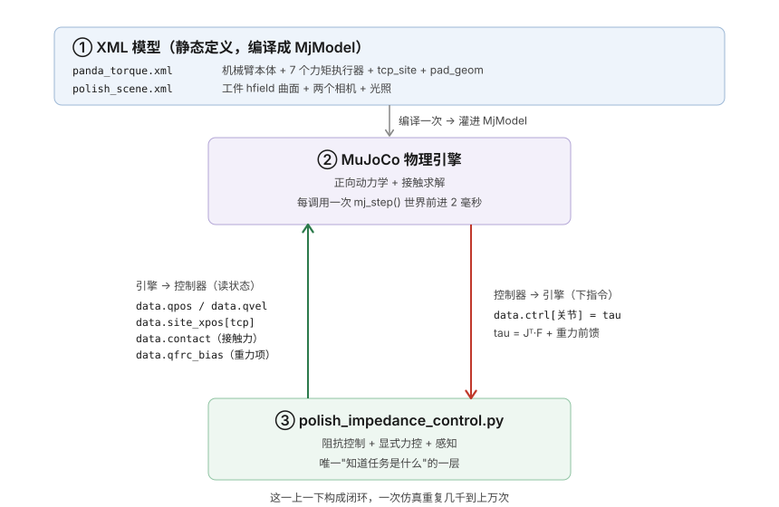

看图里的两条主干箭头，这是理解整个控制器的关键：

- **绿色（向上，引擎 → 控制器，"读状态"）**：控制器从 `data` 这个对象里读四样东西——`data.qpos`/`data.qvel`（所有关节的角度和角速度）、`data.site_xpos[tcp]`（打磨头 TCP 的世界坐标位置）、`data.contact`（当前所有接触点，用来算接触力）、`data.qfrc_bias`（MuJoCo 替你算好的重力+科氏力项）。注意这些全都挂在 `data`（`MjData`）上，因为它们每一步都在变（见 2.1 节 `MjModel` vs `MjData` 的区别）。
- **红色（向下，控制器 → 引擎，"下指令"）**：控制器写入 `data.ctrl`。其中前 6 个量是 RM65-B 关节力矩，第 7 个量是气动滑台预载命令。任务空间控制最终仍通过 (oldsymbol{	au}=J^	opmathbf{w}+mathbf{q}_{\mathrm{frc,bias}}) 变成 6 个关节力矩；气动预载则走独立执行器通道。

一句话总结这个闭环：**控制器读状态，写执行器命令。** 位姿和任务力被翻译成 6 个关节力矩；气动工具还多出一个独立预载命令。这个差别是理解当前版本不能漏掉的一层。

#### D.1.3 一次循环具体发生什么（配合下图）

把"读状态 → 决策 → 写力矩 → 推进物理"这个闭环画成流程图，就是下面这张——它也是第五章会逐行拆解的对象，这里先建立整体节奏感：

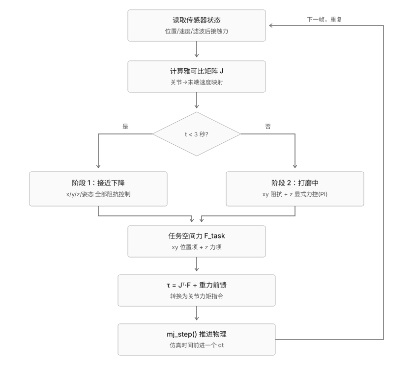

举个具体的时刻感受一下数据流动：假设仿真跑到第 5 秒（已经进入打磨阶段），某一帧里会发生——引擎告诉控制器"打磨头现在在 (0.42, 0.05, 0.315) 米、法向接触力测得 7.2 牛"；控制器算"目标力是 8 牛，还差 0.8 牛，得再压一点"，同时"x/y 该往光栅轨迹的下一个点挪一点"，把这些意图通过雅可比转置合成 7 个关节力矩、写进 `data.ctrl`；然后 `mj_step()` 让世界前进 2 毫秒，打磨头稍微下压了一点点、也横移了一点点，接触力变成了比如 7.5 牛……然后这一切重复。20 秒的仿真里，这个循环跑了大约 $`20 / 0.002 = 10000`$ 次。

> **检查点**：控制器能直接"写"进引擎的只有一样东西，是什么？（答案：`data.ctrl`，也就是每个关节的力矩指令——其它所有量都是"读"的。）

---

### D.2 历史版逐文件精读

#### D.2.1 `panda_torque.xml`：改造过的 Franka Panda

基于 MuJoCo 官方 `mujoco_menagerie` 仓库里的 Franka Panda 模型改造而来。有三处关键改动。

**改动一：执行器换成直接力矩（第 274-280 行）。**

```xml
<motor name="actuator1" joint="joint1" ctrlrange="-87 87"/>
<motor name="actuator2" joint="joint2" ctrlrange="-87 87"/>
...
<motor name="actuator5" joint="joint5" ctrlrange="-12 12"/>
```

逐个属性看：`<motor>` 是"直接力矩执行器"标签——你往 `data.ctrl` 里写什么数字，它就原样当成力矩施加到关节上，中间不做任何转换。`name="actuator1"` 是这个执行器的名字（第五章 `model.actuator("actuator1").id` 就靠它查编号）；`joint="joint1"` 说明它驱动哪个关节；`ctrlrange="-87 87"` 是允许的力矩范围（牛顿·米），关节 1-4 是 $`\pm 87`$、关节 5-7 是 $`\pm 12`$，来自 Franka 官方数据手册里各关节电机的真实力矩上限（第五章 5.7 节做力矩限幅时读的就是这个）。

为什么要换？官方原版 `panda.xml` 里关节用的是内置的**位置伺服**（position servo）执行器——你给一个目标角度，MuJoCo 内部的 PD 控制器自动帮你转过去。这对本项目完全不适用：我们要自己实现任务空间的阻抗/力控制律，需要对每个关节有直接的力矩控制权，中间不能再插一层看不见的 PD 控制器抢方向盘。

**改动二：加了 TCP 坐标系和打磨头（第 219-222 行）。**

```xml
<site name="tcp_site" pos="0 0 0.1" size="0.006" rgba="1 0 0 1"/>
<geom name="pad_geom" type="sphere" pos="0 0 0.1" size="0.015"
      rgba="0.9 0.5 0.1 1" contype="2" conaffinity="2"
      friction="0.8 0.01 0.0001" solref="0.01 1" solimp="0.9 0.95 0.001"/>
```

`<site>` 是一个"参考点"（不参与碰撞、没有质量，纯粹是个坐标标记）：`name="tcp_site"` 是 Tool Center Point，代码里所有"末端位置/姿态"都从这里读（`data.site_xpos[tcp_site_id]`）；`pos="0 0 0.1"` 是它相对 hand 的位置（沿手的 z 轴往外 0.1 米）；`size`/`rgba` 只影响在 viewer 里画出来的红点大小和颜色，不影响物理。

`<geom name="pad_geom">` 是真正跟工件接触的打磨头：`type="sphere"` 球形、`size="0.015"` 半径 1.5 厘米、`rgba="0.9 0.5 0.1 1"` 橙色。后面几个属性关系到接触物理——`contype="2" conaffinity="2"` 是"碰撞分组掩码"，决定这个几何体能跟谁碰撞（工件也设成 2，两者才会互相接触，而机械臂其它连杆是默认组，不会误撞工件）；`friction="0.8 0.01 0.0001"` 是摩擦系数（滑动/自旋/滚动）；`solref`/`solimp` 是 MuJoCo 接触求解器的"软硬"参数（接触面像多硬的弹簧、多快收敛），这里用的是偏硬的设置，让接触力响应更快。这些接触参数你现在不需要深究，知道"它们控制接触有多硬、摩擦有多大"即可。

**改动三：定义了初始姿势（第 286-288 行）。**

```xml
<keyframe>
  <key name="home" qpos="0 0 0 -1.57079 0 1.57079 -0.7853 0.04 0.04" ctrl="..."/>
</keyframe>
```

`<keyframe>` 存了一个叫 `home` 的初始状态，`qpos` 是 9 个关节的初始角度（7 个手臂关节 + 2 个手指）。第五章 `main()` 每轮开始时的 `mujoco.mj_resetDataKeyframe(model, data, key_id)` 就是把机械臂"摆回"这个姿势——这样每次仿真都从同一个已知的、手臂悬在工件上方的姿态开始。

#### D.2.2 `polish_scene.xml`：场景、曲面、相机

这个文件里有三样东西值得逐个属性讲清楚：工件曲面的"网格骨架"、工件本体、两个相机。

**（1）hfield 资产定义（第 25 行）——曲面的"网格骨架"。**

```xml
<hfield name="workpiece_hf" nrow="4" ncol="200" size="0.18 0.18 0.04 0.05"/>
```

- `name="workpiece_hf"`：这个高度场的名字，第八章 `model.hfield("workpiece_hf")` 靠它查编号。
- `nrow="4"`、`ncol="200"`：网格分辨率——沿 y 方向只有 4 行，沿 x 方向有 200 列。为什么这么不对称？因为设计上高度**只随 x 变化、沿 y 完全不变**（第八章），所以 x 方向要采样得密（200 点才能把圆弧画平滑），y 方向 4 行就够了。
- `size="0.18 0.18 0.04 0.05"`：四个数字依次是 x 方向半宽（0.18 m）、y 方向半宽（0.18 m）、`elevation_z`（0.04 m，高度数据能往上加的最大高度，第八章 `ARC_ELEVATION` 必须跟它一致）、`base_z`（0.05 m，最低点以下的实心厚度，纯粹为了让几何体是个实心方块、不至于是一张没有厚度的纸，不影响顶面形状）。

注意这里**只定义了网格有多大多密，没有定义每个格点多高**——高度数据是空的，等第八章 `fill_workpiece_hfield()` 在运行时用公式算出来填进去。这是 hfield "骨架在 XML、肉在 Python" 的分工（见 2.5 节）。

**（2）工件本体（第 51-54 行）。**

```xml
<body name="workpiece">
  <geom name="workpiece_curved" type="hfield" hfield="workpiece_hf" pos="0.5 0 0.30"
        material="workpiece_mat" contype="2" conaffinity="2" friction="0.8 0.01 0.0001"/>
</body>
```

`<body>` 是一个物体，里面挂着一个 `<geom>`（几何体）：`type="hfield"` 说明它的形状由高度场决定；`hfield="workpiece_hf"` 指定用哪张高度场（就是上面那张）；`pos="0.5 0 0.30"` 是它在世界里的位置，其中 z 分量 `0.30` 就是平坦区域的高度基准（打磨头压在平面上时 TCP 大约在这个高度）。`contype="2" conaffinity="2"` 跟 `pad_geom` 的碰撞组一致（都是 2），保证打磨头能跟工件接触、但机械臂其它部分不会误撞工件；`friction` 是工件表面的摩擦系数。

**（3）两个相机。** 第一个 `pad_view`（第 32-36 行）是给人看的观察机位：

```xml
<camera name="pad_view" mode="targetbody" target="hand" pos="0.85 -0.6 0.62"/>
```

`mode="targetbody"` 是关键——相机自身位置固定在 `pos` 那个点（不跟着机械臂运动），但朝向每一帧自动重新计算，始终对准 `target` 指定的 `hand` body。这样打磨头移到哪，镜头都稳定地对着它。第十一章详细讨论。

第二个 `scan_cam`（第 44 行）是给点云感知用的俯视深度相机：

```xml
<camera name="scan_cam" pos="0.5 0 1.0"/>
```

没有写 `mode` 也没有写 `quat`——因为 MuJoCo 相机的默认朝向本来就是沿着自身局部 -z 轴看，不加旋转时相机局部坐标系跟世界坐标系重合，正好就是"垂直往下看"，不需要额外配置。摆在 `pos="0.5 0 1.0"`（工件正上方 1 米高），配合 MuJoCo 默认的 45° 视场角（`fovy`），刚好能舒服地把整块 0.36×0.36 米的工件收进画面（习题 9 会让你算这个视场覆盖范围）。第十二章详细展开怎么用它渲染深度图、重建点云。

#### D.2.3 `polish_impedance_control.py`：整体结构

建议按这个顺序建立整体印象，再回头细读：

1. 文件顶部的 docstring（第 1-44 行）：整个控制器的设计说明，包括阶段 2 的**法线/切平面混合分解**公式，都写在这里。
2. 可调参数区（第 59-107 行）：所有增益、光栅扫描参数、工件几何参数集中定义。
3. 四个辅助函数：`raster_xy()`（第 117-147 行，光栅轨迹）、`orientation_error()`（第 150-155 行，姿态误差）、`get_contact_force_on_pad()`（第 158-176 行，读接触力）、`fill_workpiece_hfield()`（第 179-199 行，生成工件曲面数据）。
4. 感知管线四个函数（第 202-293 行）：`capture_point_cloud()`、`fit_normals_along_x()`、`estimate_normal_at_x()`、`build_orientation_from_normal()`——第十二章逐个展开。
5. `main()` 函数（第 296-454 行）：真正的控制循环，第五章逐行走读。
6. 文件末尾（第 457 行往后）：画图、保存 `polish_result.png`、打印力误差统计。

> **检查点**：`panda_torque.xml` 和 `polish_scene.xml` 分别负责定义什么？如果要把打磨对象从"平板"换成别的形状，应该改哪个文件？（答案在 4.2 节。）

---

### D.3 历史版控制循环：每一帧在做什么

`main()` 里 `for step in range(n_steps)` 每转一圈，就是下面这张流程图从上到下走一遍。记住这个节奏：每一圈只代表 2 毫秒，一次完整仿真要重复几千到上万圈。


**5.0 进循环之前先准备好的变量。** 在讲循环体之前，先交代几个"循环外只算一次、循环里反复用"的变量（`main()` 第 301-304、318-319 行），否则后面的代码会冒出一堆不知从哪来的名字：

```python
arm_dof_idx = [model.joint(name).dofadr[0] for name in ARM_JOINT_NAMES]  # 7 个手臂关节的自由度下标
arm_act_idx = [model.actuator(f"actuator{i}").id for i in range(1, 8)]    # 7 个力矩执行器的编号
tcp_site_id = model.site("tcp_site").id     # TCP 那个红点 site 的编号
pad_geom_id = model.geom("pad_geom").id     # 打磨头几何体的编号
jacp = np.zeros((3, model.nv))              # 预先开好的空数组，装位置雅可比
jacr = np.zeros((3, model.nv))              # 预先开好的空数组，装姿态雅可比
```

（`main()` 里紧挨着 `pad_geom_id` 之后还有 `gripper_act_id`、`key_id` 两个变量，以及循环外只跑一次的感知扫描 `scan_points`/`normal_x_bins`/`normal_lut`——这三个是第十二章的主角，5.3 节会再遇到它们。）

- `arm_dof_idx`——用列表推导式（见 2.0.1、2.0.15 节）查出 7 个手臂关节各自在"自由度数组"里的下标，大概是 `[0,1,2,3,4,5,6]`。后面凡是要"只取手臂那 7 个关节、跳过 2 个手指"的地方都用它做下标（见 2.0.3 节切片）。
- `arm_act_idx`——同理，7 个力矩执行器的编号，写 `data.ctrl` 时用。
- `tcp_site_id`、`pad_geom_id`——TCP 和打磨头的编号，读位置/读接触力时用。
- `jacp`、`jacr`——两个 3×`nv` 的**空数组**（`nv` 是总自由度数，本项目是 9）。为什么循环外先开好？因为 MuJoCo 算雅可比的函数是"你给我一个容器，我把结果填进去"的风格（不返回新数组），循环外开一次、循环里反复覆写，比每帧新建数组省内存（见 2.5 节末尾同款套路）。

下面对照循环体逐段说明（行号来自 `polish_impedance_control.py`）。

**5.1 计算雅可比（第 353-354 行）**

```python
mujoco.mj_jacSite(model, data, jacp, jacr, tcp_site_id)
J = np.vstack([jacp[:, arm_dof_idx], jacr[:, arm_dof_idx]])  # 6x7
```

第一行：`mj_jacSite` 计算 `tcp_site_id` 这个点的雅可比，把结果**填进** `jacp`（位置部分，3×9）和 `jacr`（姿态部分，3×9）——注意它没有返回值，是直接改写你传进去的 `jacp`/`jacr`（见 5.0 节解释的"填容器"风格）。第二行：`jacp[:, arm_dof_idx]` 用切片（见 2.0.3 节）从 9 列里挑出手臂那 7 列，变成 3×7；`jacr` 同理；`np.vstack`（见 2.0.4 节）把这两个 3×7 上下叠成一个 6×7 的矩阵 `J`——上面 3 行管末端**位置**，下面 3 行管末端**姿态**。这个 `J` 就是 2.3 节讲的雅可比，本帧后面会用它两次。

**5.2 读末端状态（第 356-361 行）**

```python
x_cur = data.site_xpos[tcp_site_id].copy()
R_cur = data.site_xmat[tcp_site_id].reshape(3, 3).copy()
vel6 = J @ data.qvel[arm_dof_idx]
x_dot, omega = vel6[:3], vel6[3:]
```

- `x_cur`——打磨头 TCP 此刻的世界坐标位置，一个 3 维向量 `[x, y, z]`。`data.site_xpos[tcp_site_id]` 是 MuJoCo 每步自动算好的，直接读；末尾 `.copy()` 是拍快照防止被下一步 `mj_step` 改掉（见 2.0.6 节视图 vs 拷贝）。
- `R_cur`——TCP 此刻的姿态，一个 3×3 旋转矩阵。MuJoCo 把它存成拉平的 9 个数，`.reshape(3, 3)`（见 2.0.7 节）叠回矩阵，再 `.copy()`。
- `vel6 = J @ data.qvel[arm_dof_idx]`——这是雅可比第一次派上用场：`data.qvel[arm_dof_idx]` 是 7 个手臂关节的角速度，用 `@`（矩阵乘，见 2.0.5 节）左乘 `J`，得到末端的 6 维速度（前 3 是线速度、后 3 是角速度）。这就是 2.3 节公式 $`\dot x = J\dot q`$ 的代码实现。
- `x_dot, omega = vel6[:3], vel6[3:]`——用切片 + 多重赋值（见 2.0.3 节）把 6 维速度拆成线速度 `x_dot` 和角速度 `omega`。这两个量是阻抗控制阻尼项（第六章）要用的——这也是为什么必须先算雅可比：`data.qvel` 只有关节速度，末端速度得靠 `J` 转出来。

**5.3 局部法线、接触力投影与低通滤波（第 369、375-377 行）**

```python
local_normal = estimate_normal_at_x(x_cur[0], normal_x_bins, normal_lut)

f_raw = get_contact_force_on_pad(model, data, pad_geom_id)
f_n_raw = f_raw @ local_normal
f_filt += F_FILT_ALPHA * (f_n_raw - f_filt)
```

- `local_normal`——当前 x 位置（`x_cur[0]` 是 5.2 节读到的末端位置的 x 分量）处，工件表面的局部法线方向，从预先扫描好的查表里插值得到（`normal_x_bins`、`normal_lut` 是循环外一次性算好的，第十二章详解怎么从深度相机点云里拟合出来）。这一行现在排在接触力读取**之前**，因为下面这行力投影需要用到它——这是本节相比早期版本最重要的顺序变化。
- `f_raw`——打磨头此刻受到的接触力，一个世界坐标系下的 3 维向量（由辅助函数 `get_contact_force_on_pad` 把所有接触点的力加起来、转到世界系，见第四章提到的它内部用 `mj_contactForce`）。
- `f_n_raw = f_raw @ local_normal`——这是本次改造的核心一行。`local_normal` 是单位向量，`f_raw @ local_normal` 在这里不是矩阵乘法，而是**两个一维数组的点积**（2.0.5 节讲的 `@` 在两边都是一维数组时退化成点积，结果是一个标量，不是矩阵）：$`f_n = \vec f_{\text{raw}} \cdot \hat n`$。几何意义是把接触力矢量投影到局部法线方向上，得到"真正压向工件表面的那部分力的大小"——早期版本直接取 `f_raw[2]`（只看世界 z 分量），在法线倾斜时这两者并不相等，第七章 7.5 节会精确算出这个差距有多大。
- `f_filt += F_FILT_ALPHA * (f_n_raw - f_filt)`——低通滤波本身完全没变，只是滤波对象从 `f_z_raw` 换成了投影后的 `f_n_raw`。展开成完整赋值就是 `f_filt = f_filt + α*(f_n_raw - f_filt)`，也就是每一步把 `f_filt` 往最新读数挪一小步，步长比例是 `α = F_FILT_ALPHA = 0.03`。

为什么要滤波？MuJoCo 在离散时间步下算出的接触力天然是**脉冲状的毛刺**——同一时刻真实压力大概 8 牛，但逐帧读出来可能在 0 到 20 牛之间剧烈跳变。下面这张图是真实仿真数据，灰色是原始读数（滤波前的投影力），可以看到它有多脏：

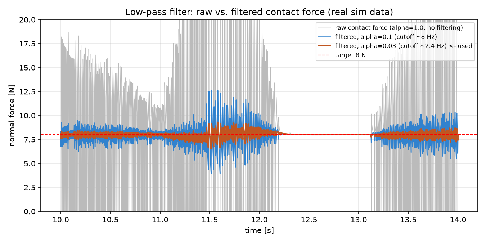

灰线（原始，等价于 `α=1.0` 完全不滤波）在 0~20 牛之间狂抖；蓝线（`α=0.1`）平滑了很多但还有明显起伏；橙线（`α=0.03`，代码里实际用的）紧紧贴着 8 牛目标。（图中 12.3~13.1 秒那段灰线掉到 0，是打磨头换行时短暂离开了工件表面，属于正常现象。）

这个滤波的数学形式是**指数滑动平均（EMA）**，也叫一阶低通：

$$
f_{\text{filt}}^{(k)} = f_{\text{filt}}^{(k-1)} + \alpha \left( f_{n,\text{raw}}^{(k)} - f_{\text{filt}}^{(k-1)} \right)
= (1-\alpha)\,f_{\text{filt}}^{(k-1)} + \alpha\, f_{n,\text{raw}}^{(k)}
$$

第二个等号把它改写成"旧值占 $`1-\alpha`$、新读数占 $`\alpha`$"的加权平均，更能看出 `α` 的物理含义：

- **`α` 是"对新读数的信任程度 / 滤波器的健忘程度"。** `α=1` 完全信新读数（等于不滤波）；`α` 越小，越依赖历史积累的平滑值、对单帧的毛刺越"迟钝"。`α=0.03` 意味着每一帧只往新读数挪 3%，需要几十帧才能对一个真实的变化完全响应过来——这种"迟钝"对高频毛刺是好事（毛刺来不及影响它），对真实的缓慢变化影响不大（真实力变化很慢，几十帧的延迟无所谓）。
- **它等价于电路里的 RC 低通滤波器**，有一个**截止频率**：低于这个频率的信号基本原样通过，高于它的被大幅压掉。近似公式（$`f_s=500`$ Hz 是仿真频率）：

$$
f_c \approx \frac{\alpha \cdot f_s}{2\pi}
$$

`α=0.1` 对应约 8 Hz，`α=0.03` 对应约 2.4 Hz。为什么 2.4 Hz 这条线切得好？因为真正关心的信号（力缓慢趋近目标、随曲面缓慢变化）频率远低于 1 Hz，而接触求解器的数值毛刺集中在几十到几百 Hz——**真信号和噪声天生住在频谱的两端，中间隔得很开**，随便在中间插一条线就能几乎无损地把两者分开。

`α` 具体该取多少不是拍脑袋定的——第十章 10.8 节有一次专门针对这个系数的调参案例，讲清楚为什么从 0.1 调到 0.03 反而让力误差和稳定性都变好，以及为什么"加 PID 的 D 项"和"用已知曲率做前馈"这两条看起来更高级的路都没用。

**5.4 姿态目标：实时贴合局部法线（第 381-383 行）**

```python
R_target = build_orientation_from_normal(local_normal)
rot_err = orientation_error(R_target, R_cur)
rot_wrench = KP_ROT * rot_err - KD_ROT * omega
```

- `local_normal`——5.3 节已经算好的局部表面法线；这里是它在本帧的**第二个用途**（第一个用途是 5.3 节的力投影），姿态、力、切平面运动三处都读同一个 `local_normal`，保证三者对"表面朝向"的理解永远一致（第十二章 12.6 节会讲第三个用途）。
- `R_target`——把这个法线转换成"打磨头该摆成什么姿态"的目标旋转矩阵（第十二章 12.4 节）。在平面区域它精确等于"垂直朝下"，在圆弧区域会跟着倾斜。
- `rot_err = orientation_error(R_target, R_cur)`——目标姿态 `R_target` 和当前姿态 `R_cur`（5.2 节读到的）之间的姿态误差，一个 3 维向量（用 so(3) 对数映射近似，见第六章）。
- `rot_wrench = KP_ROT * rot_err - KD_ROT * omega`——这就是阻抗控制律用在姿态上：`KP_ROT`（姿态刚度）乘姿态误差是"把姿态拉向目标"的力矩，`KD_ROT`（姿态阻尼）乘角速度 `omega`（5.2 节的）是反向刹车。跟第六章位置阻抗是**完全同一个公式**，只是作用在旋转上。

这段原来只有一行写死的"永远垂直朝下"；现在换成每帧实时查法线、动态算目标姿态——这是第十二章新增功能的入口。

**5.5 阶段判断与任务力计算（第 385-423 行）**

```python
if t < 3.0:
    # 阶段 1：全轴阻抗控制，平滑下降接触工件
    ...   # 算出 F_xyz（x/y/z 都用阻抗）
else:
    # 阶段 2：法线方向显式力控 + 切平面阻抗跟踪光栅轨迹
    ...   # 算出 F_xyz = F_normal + F_tangent
```

`t` 是当前仿真时刻（秒）。前 3 秒（阶段 1）机械臂还没接触工件，三个方向都用阻抗控制把它平滑压下去，跟第六章讲的公式完全一样；3 秒后（阶段 2）切换成本次改造的核心——**在局部表面坐标系里做混合分解**，而不再是"z 用力控、xy 用阻抗"这种世界轴对齐的写法。阶段 2 的具体代码（第 398-423 行）：

```python
n = local_normal

# -- 法线方向：显式力控制 --
f_err = F_TARGET - f_filt
f_integral = np.clip(f_integral + f_err * dt, -I_CLAMP, I_CLAMP)
vn = x_dot @ n
Fn_cmd = -(F_TARGET + KP_F * f_err + KI_F * f_integral) - BZ * vn
F_normal = Fn_cmd * n

# -- 切平面：阻抗控制跟踪光栅目标 --
xy = raster_xy(t - 3.0)
pos_err = np.array([xy[0] - x_cur[0], xy[1] - x_cur[1], 0.0])
pos_err_tan = pos_err - (pos_err @ n) * n
v_tan = x_dot - (x_dot @ n) * n
F_tangent = KP_POS_XY[0] * pos_err_tan - KD_POS_XY[0] * v_tan

F_xyz = F_normal + F_tangent
```

- `n = local_normal`——起个短名字，纯粹是为了让下面的公式不那么啰嗦；`n` 就是 5.3 节算出的、本帧固定不变的局部法线单位向量。
- 法线方向那五行和第七章 7.2 节的力控制律是**同一套公式**，唯一区别是这里显式写出了 `vn = x_dot @ n`（末端速度在法线方向上的分量，同样是点积，不是矩阵乘）和 `F_normal = Fn_cmd * n`（把标量力沿法线方向"撑开"成一个 3 维力向量）——详细推导见第七章。
- `xy = raster_xy(t - 3.0)`——跟旧版本完全一样，光栅轨迹只关心 x/y，不关心 z（第九章）。
- `pos_err = np.array([xy[0] - x_cur[0], xy[1] - x_cur[1], 0.0])`——先按老办法算出 x/y 方向的位置误差，z 分量填 0（因为光栅轨迹从不对 z 提要求，z 完全交给上面的法线力控）。
- `pos_err_tan = pos_err - (pos_err @ n) * n`——这是把 `pos_err` **投影到切平面**的标准公式：`(pos_err @ n) * n` 是 `pos_err` 在法线方向上的分量，原向量减去这部分，剩下的自然就落在与 `n` 垂直的切平面里。第七章 7.5 节会画图说明这个投影的几何意义。
- `v_tan = x_dot - (x_dot @ n) * n`——同样的投影公式用在末端速度上，得到"贴着表面滑动"的那部分速度，滤掉法线方向的速度分量（那部分已经由 `vn` 在力控制里处理了）。
- `F_tangent = KP_POS_XY[0] * pos_err_tan - KD_POS_XY[0] * v_tan`——第六章的阻抗公式 $`F=K_p e - K_d\dot x`$，只是这次 `e` 和 `\dot x` 都换成了切平面内的投影版本；在平面区域 `n=(0,0,1)`，`pos_err_tan` 和 `v_tan` 会精确退化成原来的 `(pos_err[0], pos_err[1], 0)` 和 `(x_dot[0], x_dot[1], 0)`，跟旧版本逐位相等。
- `F_xyz = F_normal + F_tangent`——两个正交子空间（法线 1 维 + 切平面 2 维）算出的力向量分量直接相加即可合成完整的 3 维任务力，因为它们天然不重叠、不会互相抵消或叠加出多余的分量——这正是第七章 7.5 节要强调的"分解成正交子空间"的意义。

两个阶段算出的都是同一种东西——一个 3 维任务空间力向量 `F_xyz`，下游代码完全不关心它是哪个阶段算的。第六、七章分别详细展开两个阶段各自的公式。

**5.6 合并、转矩、重力前馈（第 425-427 行）**

```python
F_task = np.concatenate([F_xyz, rot_wrench])   # 6维：3维力 + 3维力矩
tau_task = J.T @ F_task                         # 6维 -> 7维关节力矩
tau = tau_task + data.qfrc_bias[arm_dof_idx]    # 加上重力/科氏力前馈
```

- `F_task`——把 5.5 节的 3 维力 `F_xyz` 和 5.4 节的 3 维力矩 `rot_wrench` 首尾拼成一个 6 维向量（`np.concatenate` 拼接，见 2.0 节末尾风格），对应 6×7 雅可比的 6 行。
- `tau_task = J.T @ F_task`——雅可比第二次派上用场，也是全书最关键的一行：`J.T`（转置，见 2.0.5 节）是 7×6，乘 6 维的 `F_task` 得到 7 维的关节力矩 `tau_task`。为什么是转置？虚功原理：末端力做的虚功必须等于关节力矩做的虚功——

$$
\delta W = F_{\text{task}}^\top \, \delta x = F_{\text{task}}^\top \, J \, \delta q = \left(J^\top F_{\text{task}}\right)^\top \delta q = \tau_{\text{task}}^\top \, \delta q
$$

$`J`$ 把关节速度映射到末端速度（5.2 节），转置后自然把末端力映射回关节力矩，方向相反、数学上严格配对，不是巧合。
- `tau = tau_task + data.qfrc_bias[arm_dof_idx]`——加上重力/科氏力前馈（见 2.4 节）。`data.qfrc_bias` 是 MuJoCo 替你算好的"光扛住手臂自重和运动惯性需要多少力矩"，加上它之后，上面的 `tau_task` 就只需要专心处理"任务误差"，不用再分心对抗重力。

**5.7 限幅、写入、推进物理（第 429-433 行）**

```python
for k, aidx in enumerate(arm_act_idx):
    lo, hi = model.actuator_ctrlrange[aidx]
    data.ctrl[aidx] = np.clip(tau[k], lo, hi)
mujoco.mj_step(model, data)
```

`enumerate`（见 2.0.9 节）同时给出"第几个"（`k`，用来取 `tau[k]`）和"执行器编号"（`aidx`）。`lo, hi = model.actuator_ctrlrange[aidx]` 解包出这个关节的力矩上下限（就是第四章 4.1 节 `ctrlrange="-87 87"` 那些数）；`np.clip(tau[k], lo, hi)`（见 2.0.8 节）把算出的力矩夹到合法范围再写进 `data.ctrl[aidx]`——这是控制器唯一"写"进引擎的地方（呼应第三章 3.2 节）。最后 `mj_step` 让物理世界前进 2 毫秒，循环回到 5.1 节，重新读一遍状态。

> **检查点**：为什么必须先算雅可比，才能读到末端速度？（提示：`data.qvel` 只有关节速度，末端速度需要 $`J\dot q`$，见 5.2 节。）

---

### D.4 历史版 6 行光栅扫描轨迹

#### D.4.1 为什么不再画一个固定小圆

项目最早的版本里，阶段 2 的 x/y 目标是一个半径 6 厘米、固定圆心的圆——能演示阻抗控制+力控制的基本结构，但严格来说只是"在同一个地方反复打磨一小圈"。要覆盖整个工件表面，需要一条能把 x、y 坐标系统性地扫过整个矩形区域的轨迹，这就是光栅扫描（boustrophedon / raster scan）——名字来自古希腊农夫犁地的方式：犁完一行不抬起来搬回起点，直接调头往回犁下一行，像"之"字一样来回推进。

下图是实际的扫描路径（6 行，横跨平面和圆弧两个区域）：

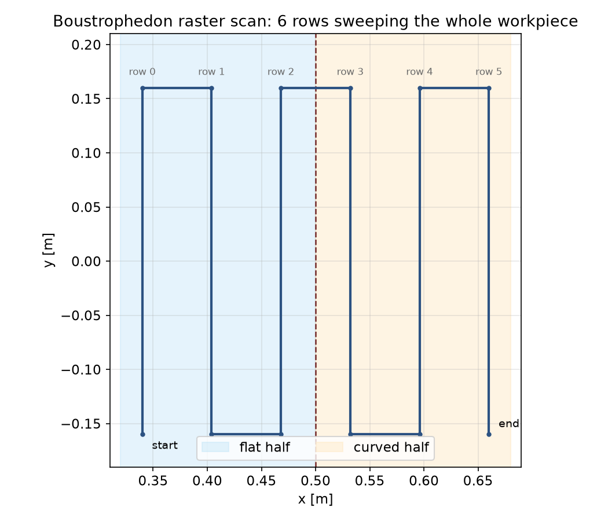

蓝色区域是平面半（row 0-2 大致在这里），橙色区域是圆弧半（row 3-5），中间红色虚线是第八章那条相切交界线 $`x=0.50`$。轨迹从左下角开始，一路"之"字形扫到右上角结束——每一行结束的地方正好是下一行开始的地方，不需要额外移动就能无缝衔接。

#### D.4.2 参数与实现

第 79-88 行定义了参数：

```python
RASTER_X_MIN, RASTER_X_MAX = 0.34, 0.66     # x 方向扫描范围
RASTER_Y_MIN, RASTER_Y_MAX = -0.16, 0.16    # y 方向扫描范围
RASTER_ROWS = 6                              # 一共 6 行
RASTER_ROW_PERIOD = 8.0                      # 每行用时 8 秒
RASTER_TRANSITION_TIME = 0.4                 # 换行时 x 平滑过渡的时间
```

`raster_xy(t_polish)` 函数（第 107-137 行）接收"打磨阶段已经过去多久"这一个时间戳，返回此刻应该在的 $`(x,y)`$ 坐标。这是一个纯数学函数——不读取任何 MuJoCo 状态，只靠时间就能算出目标位置，这一点很重要，第十章调参分析会用到这个性质。完整代码：

```python
def _raster_row_x(row):
    if RASTER_ROWS > 1:
        return RASTER_X_MIN + (RASTER_X_MAX - RASTER_X_MIN) * row / (RASTER_ROWS - 1)
    return RASTER_X_MIN


def raster_xy(t_polish):
    row = min(int(t_polish // RASTER_ROW_PERIOD), RASTER_ROWS - 1)
    t_in_row = t_polish - row * RASTER_ROW_PERIOD
    row_t = np.clip(t_in_row / RASTER_ROW_PERIOD, 0.0, 1.0)
    row_t_smooth = row_t * row_t * (3 - 2 * row_t)

    x = _raster_row_x(row)
    if row > 0 and t_in_row < RASTER_TRANSITION_TIME:
        blend = t_in_row / RASTER_TRANSITION_TIME
        x = _raster_row_x(row - 1) + (x - _raster_row_x(row - 1)) * blend

    if row % 2 == 0:
        y = RASTER_Y_MIN + (RASTER_Y_MAX - RASTER_Y_MIN) * row_t_smooth
    else:
        y = RASTER_Y_MAX - (RASTER_Y_MAX - RASTER_Y_MIN) * row_t_smooth
    return np.array([x, y])
```

逐个变量交代清楚：

- `_raster_row_x(row)` 是个独立的小函数，纯粹是"线性插值"：`row=0` 时返回 `RASTER_X_MIN`，`row=RASTER_ROWS-1`（也就是最后一行）时返回 `RASTER_X_MAX`，中间的行按比例均匀分布。`row / (RASTER_ROWS - 1)` 这个比例就是"6 行里排第几个百分比位置"。
- `row = min(int(t_polish // RASTER_ROW_PERIOD), RASTER_ROWS - 1)`——`t_polish // RASTER_ROW_PERIOD`（见 2.0.11 节 `//` 整除）算出"已经过去了几个完整的 8 秒"，也就是"现在是第几行"；外层 `int(...)` 保证结果是整数下标；最外层 `min(..., RASTER_ROWS - 1)` 是防越界——`t_polish` 会一直增长，不加这个 `min` 到了最后一行结束之后行号还会继续往上涨，变成一个不存在的行。
- `t_in_row = t_polish - row * RASTER_ROW_PERIOD`——"当前这一行，已经走了多少秒"，用总时间减去"前面几行一共用掉的时间"。
- `row_t = np.clip(t_in_row / RASTER_ROW_PERIOD, 0.0, 1.0)`——把 `t_in_row` 换算成"这一行走了百分之多少"，`np.clip` 防止最后一行结束后这个比例超过 1（见 2.0.8 节）。
- `row_t_smooth = row_t * row_t * (3 - 2 * row_t)`——这是 **smoothstep** 函数（数学式见下方），把"匀速的百分比" `row_t` 换算成"两端速度自然趋近于 0"的百分比，专门用来让每一行开始和结束时的运动更平滑。
- `x = _raster_row_x(row)`，接下来那个 `if` 块：`row > 0 and t_in_row < RASTER_TRANSITION_TIME` 判断"是不是刚换到新的一行、而且还在换行过渡期内"；如果是，`blend = t_in_row / RASTER_TRANSITION_TIME` 算出"过渡进行到百分之多少"，再用它把 `x` 从"上一行的位置"线性滑动到"这一行的位置"——过渡期一过，`x` 就固定在 `_raster_row_x(row)` 不再变化（回忆第十章 10.2 节：这个过渡最早被怀疑是 force spike 的根因，后来证明不是）。
- `row % 2 == 0`（见 2.0.11 节 `%` 取模）判断这一行是偶数行还是奇数行：偶数行 y 从 `RASTER_Y_MIN` 扫向 `RASTER_Y_MAX`，奇数行反过来——这就是"之"字形来回扫描的全部逻辑。

#### D.4.3 两处平滑处理

为了避免轨迹目标位置发生突变（这会在第十章造成大问题），代码在两处做了平滑：换行时 `x` 不是瞬间跳变，而是用上面看到的 `blend` 变量在 `RASTER_TRANSITION_TIME`（0.4 秒）内线性滑动过去；每一行内部 `y` 的运动用 `row_t_smooth`（smoothstep）而不是 `row_t` 本身（匀速直线）：

$$
u = \text{row\_t}, \qquad \text{smoothstep}(u) = 3u^2 - 2u^3
$$

代入 $`u=0`$：`smoothstep(0) = 0`；代入 $`u=1`$：`smoothstep(1) = 3-2 = 1`——两端跟原来的 `row_t` 取值一样，保证起点终点位置没变。但求一次导数：

$$
\frac{d}{du}\,\text{smoothstep}(u) = 6u - 6u^2 = 6u(1-u)
$$

在 $`u=0`$ 和 $`u=1`$ 处这个导数都精确等于 0——这就是"两端速度自然减速到 0"的数学来源，让速度在每行的起点和终点都平滑归零，而不是硬生生掉头。

> **检查点**：`row = min(int(t_polish // RASTER_ROW_PERIOD), RASTER_ROWS - 1)` 里的 `min(...)` 是为了防止什么？（提示：`t_polish` 一直在增长，整除算出的行号如果不做限制，最后会超出实际的行数。）

---
